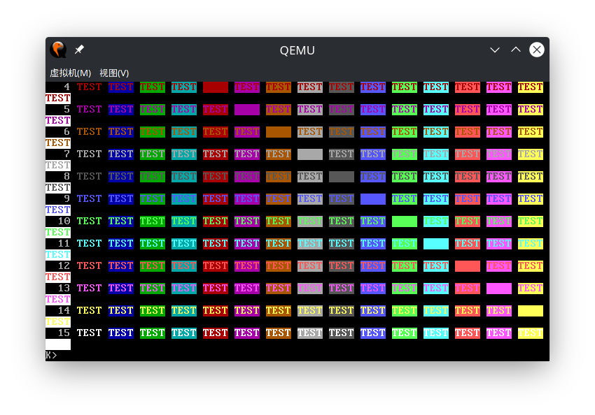
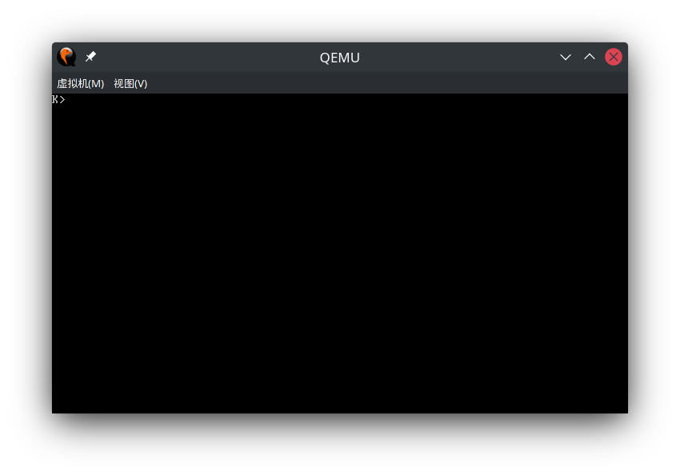

# Report for lab1, Kexing Zhou

[TOC]

## Environment Configuration

```
Hardware Environment:
Memory:         16GB
Processor:      Intel® Core™ i7-8550U CPU @ 1.66GHz × 8
GPU:            NVIDIA GeForce RTX 2070
OS Type:        64 bit
Disk:           924GB

Software Environment:
OS:             Arch Linux
Gcc:            Gcc 11.1.0
Make:           GNU Make 4.3
Gdb:            GNU gdb 11.1
```

### Test Compiler Toolchain

```bash
$ objdump -i   # the 5th line say elf32-i386
$ gcc -m32 -print-libgcc-file-name
/usr/lib/gcc/x86_64-pc-linux-gnu/11.1.0/32/libgcc.a
```

### QEMU Emulator
```bash
$ sudo pacman -S riscv64-linux-gnu-binutils \
    riscv64-linux-gnu-gcc riscv64-linux-gnu-gdb qemu-arch-extra
```

## PC bootstrap

### Exercise 1

(nothing to report)

### Exercise 2

System starts at memory address 0xffff0. There, computer will read a `ljmp` command and jump to bios program start at 0xfe05b.

```nasm
[f000:fff0]    0xffff0: ljmp   $0x3630,$0xf000e05b
(gdb) si
[f000:e05b]    0xfe05b: cmpw   $0x8,%cs:(%esi)
```

Bios first setup ss, sp, dx:

```nasm
[f000:e062]    0xfe062: jne    0xd241d0a4
[f000:e066]    0xfe066: xor    %edx,%edx
[f000:e068]    0xfe068: mov    %edx,%ss
[f000:e06a]    0xfe06a: mov    $0x7000,%sp
[f000:e070]    0xfe070: mov    $0x33c,%dx
[f000:e076]    0xfe076: jmp    0x5576cf2a
```

Then setup interrupt, Global Descriptor Table and Interrupts Descriptor Table then launch protected mode.

```nasm
[f000:cf28]    0xfcf28: cli
[f000:cf29]    0xfcf29: cld
[f000:cf2a]    0xfcf2a: mov    %ax,%cx
[f000:cf2d]    0xfcf2d: mov    $0x8f,%ax
# setup non-maskable interrupt
[f000:cf33]    0xfcf33: out    %al,$0x70
[f000:cf35]    0xfcf35: in     $0x71,%al
# setup system devices
[f000:cf37]    0xfcf37: in     $0x92,%al
[f000:cf39]    0xfcf39: or     $0x2,%al 
[f000:cf3b]    0xfcf3b: out    %al,$0x92
[f000:cf3d]    0xfcf3d: mov    %cx,%ax
# setup GDT and IDT
[f000:cf40]    0xfcf40: lidtl  %cs:(%esi)
[f000:cf46]    0xfcf46: lgdtl  %cs:(%esi)
# launch protected mode
[f000:cf4c]    0xfcf4c: mov    %cr0,%ecx
[f000:cf4f]    0xfcf4f: and    $0xffff,%cx
[f000:cf56]    0xfcf56: or     $0x1,%cx 
[f000:cf5a]    0xfcf5a: mov    %ecx,%cr0
# goto 32bit code
[f000:cf5d]    0xfcf5d: ljmpw  $0xf,$0xcf65
```

Then bios setup ds, es, ss, fs, gs, and jump to bios code.

```nasm
0xfcf65:     mov    $0x10,%ecx
0xfcf6a:     mov    %ecx,%ds
0xfcf6c:     mov    %ecx,%es
0xfcf6e:     mov    %ecx,%ss
0xfcf70:     mov    %ecx,%fs
0xfcf72:     mov    %ecx,%gs
0xfcf74:     jmp    *%edx
```

The bios code is too complex to analysis, but it looks like it is well-compiled by some compiler:

```nasm
(gdb) x/10i
0xf033c:     push   %ebx
0xf033d:     sub    $0x20,%esp      
0xf0340:     call   0xecd04         
0xf0345:     mov    $0x40000000,%ebx
0xf034a:     lea    0xc(%esp),%eax  
0xf034e:     push   %eax            
0xf034f:     lea    0xc(%esp),%eax  
0xf0353:     push   %eax            
0xf0354:     lea    0xc(%esp),%ecx  
0xf0358:     lea    0x8(%esp),%edx  
0xf035c:     mov    %ebx,%eax
```

I think bios set up some system device in these process, and exit protected mode and jump to start point, 0x7c00.

I tried `watch $cr0` to find out when the bios exits proctected mode, but it stucks gdb and not works well. The exit of protected mode is very misterious.

### Exercise 3

The disas code at 0x7c00 is:

```nasm
(gdb) b *0x7c00
Breakpoint 1 at 0x7c00
(gdb) c
Continuing.
[   0:7c00] => 0x7c00:  cli    

Breakpoint 1, 0x00007c00 in ?? ()
(gdb) x/10i
   0x7c01:      cld    
   0x7c02:      xor    %eax,%eax
   0x7c04:      mov    %eax,%ds
   0x7c06:      mov    %eax,%es
   0x7c08:      mov    %eax,%ss
   0x7c0a:      in     $0x64,%al
   0x7c0c:      test   $0x2,%al
   0x7c0e:      jne    0x7c0a
   0x7c10:      mov    $0xd1,%al
   0x7c12:      out    %al,$0x64
(gdb) 
```

The assembly code are equal in boot.S and boot.asm.

**Identify the exact assembly instructions that correspond to each of the statements in readsect()**:

At boot.asm, Line 150:

```nasm
00007c78 <readsect>:

void
readsect(void *dst, uint32_t offset)
{
    7c78:	55                   	push   %ebp
    7c79:	89 e5                	mov    %esp,%ebp
    7c7b:	57                   	push   %edi
    7c7c:	50                   	push   %eax
    7c7d:	8b 4d 0c             	mov    0xc(%ebp),%ecx
	// wait for disk to be ready
	waitdisk();
    7c80:	e8 e5 ff ff ff       	call   7c6a <waitdisk>
}
```

**identify the begin and end of the for loop that reads the remaining sectors of the kernel from the disk.**

At boot.asm, Line 291.

```nasm
	for (; ph < eph; ph++)
    7d56:	39 f3                	cmp    %esi,%ebx
    7d58:	73 17                	jae    7d71 <bootmain+0x58>
		readseg(ph->p_pa, ph->p_memsz, ph->p_offset);
    7d5a:	50                   	push   %eax
	for (; ph < eph; ph++)
    7d5b:	83 c3 20             	add    $0x20,%ebx
		readseg(ph->p_pa, ph->p_memsz, ph->p_offset);
    7d5e:	ff 73 e4             	push   -0x1c(%ebx)
    7d61:	ff 73 f4             	push   -0xc(%ebx)
    7d64:	ff 73 ec             	push   -0x14(%ebx)
    7d67:	e8 6e ff ff ff       	call   7cda <readseg>
	for (; ph < eph; ph++)
    7d6c:	83 c4 10             	add    $0x10,%esp
    7d6f:	eb e5                	jmp    7d56 <bootmain+0x3d>
	((void (*)(void)) (ELFHDR->e_entry))();
    7d71:	ff 15 18 00 01 00    	call   *0x10018
```

**set a breakpoint there, and continue to that breakpoint.**

```nasm
(gdb) b *(0x7d71)
Breakpoint 2 at 0x7d71
(gdb) c
Continuing.
=> 0x7d71:      call   *0x10018
(gdb) si
=> 0x10000c:    movw   $0x1234,0x472
0x0010000c in ?? ()
(gdb) x/10i
   0x100015:    mov    $0x111000,%eax
   0x10001a:    mov    %eax,%cr3
   0x10001d:    mov    %cr0,%eax
   0x100020:    or     $0x80010001,%eax
   0x100025:    mov    %eax,%cr0
   0x100028:    mov    $0xf010002f,%eax
   0x10002d:    jmp    *%eax
   0x10002f:    mov    $0x0,%ebp
   0x100034:    mov    $0xf010f000,%esp
   0x100039:    call   0x1000a6
```

### Exercise 4

```c++
void
f(void)
{
    int a[4];
    int *b = malloc(16);
    int *c;
    int i;

    // print address of a, b, c
    printf("1: a = %p, b = %p, c = %p\n", a, b, c);

    c = a; // make c point to a[1]
    for (i = 0; i < 4; i++)
	a[i] = 100 + i; // set the i-th elements of a 100 + i
    c[0] = 200; // change c[0] to 200, a[0] also changes
    // print value of array A's first to forth element
    printf("2: a[0] = %d, a[1] = %d, a[2] = %d, a[3] = %d\n",
	   a[0], a[1], a[2], a[3]);
    // value in a: 200 101 102 103

    c[1] = 300; // change c[1] to 300, a[1] also changes
    *(c + 2) = 301; // change *(c+2) = c[2] to 301, a[2] alse changes
    3[c] = 302; // 3[c] mean *(3 + c) = *(c + 3) = c[3], change c[3] to 302, a[3] also changes
    printf("3: a[0] = %d, a[1] = %d, a[2] = %d, a[3] = %d\n",  # 
	   a[0], a[1], a[2], a[3]);
    // value in a: 200 300 301 302

    c = c + 1;  // make c point to a[1]
    *c = 400;   // change c[0] to 400, a[1] also changes
    printf("4: a[0] = %d, a[1] = %d, a[2] = %d, a[3] = %d\n",
	   a[0], a[1], a[2], a[3]);
    // value in a: 200 400 301 302

    c = (int *) ((char *) c + 1); // make c point to a byte after a[1]
    *c = 500;                     // change the last 3 byte of a[1] and the first byte of a[2]
    printf("5: a[0] = %d, a[1] = %d, a[2] = %d, a[3] = %d\n",
	   a[0], a[1], a[2], a[3]);
    // value in a: 200 128144 256 302

    b = (int *) a + 1;            // make b point to a[1]
    c = (int *) ((char *) a + 1); // make c point to a byte after a[0]
    printf("6: a = %p, b = %p, c = %p\n", a, b, c);
}
```

### Exercise 5

The original bootloader:

```nasm
=> 0x7c00:      cli    
   0x7c01:      cld    
   0x7c02:      xor    %eax,%eax
   0x7c04:      mov    %eax,%ds
   0x7c06:      mov    %eax,%es
   0x7c08:      mov    %eax,%ss
   0x7c0a:      in     $0x64,%al
   0x7c0c:      test   $0x2,%al
   0x7c0e:      jne    0x7c0a
   0x7c10:      mov    $0xd1,%al
   0x7c12:      out    %al,$0x64
   0x7c14:      in     $0x64,%al
   0x7c16:      test   $0x2,%al
   0x7c18:      jne    0x7c14
   0x7c1a:      mov    $0xdf,%al
   0x7c1c:      out    %al,$0x60
   0x7c1e:      lgdtl  (%esi)
   0x7c21:      fs jl  0x7c33
   0x7c24:      and    %al,%al
   0x7c26:      or     $0x1,%ax
   0x7c2a:      mov    %eax,%cr0
   0x7c2d:      ljmp   $0xb866,$0x87c32 # (*)
   0x7c34:      adc    %al,(%eax)
   0x7c36:      mov    %eax,%ds
   0x7c38:      mov    %eax,%es
   0x7c3a:      mov    %eax,%fs
   0x7c3c:      mov    %eax,%gs
   0x7c3e:      mov    %eax,%ss
   0x7c40:      mov    $0x7c00,%esp
   0x7c45:      call   0x7d19

```

I change boot/Makefrag, Line 28:
```
- $(V)$(LD) $(LDFLAGS) -N -e start -Ttext 0x7C00 -o $@.out $^
+ $(V)$(LD) $(LDFLAGS) -N -e start -Ttext 0x0000 -o $@.out $^
```

Then restart the bootloader.

```nasm
=> 0x7c00:      cli    
   0x7c01:      cld    
   0x7c02:      xor    %eax,%eax
   0x7c04:      mov    %eax,%ds
   0x7c06:      mov    %eax,%es
   0x7c08:      mov    %eax,%ss
   0x7c0a:      in     $0x64,%al
   0x7c0c:      test   $0x2,%al
   0x7c0e:      jne    0x7c0a
   0x7c10:      mov    $0xd1,%al
   0x7c12:      out    %al,$0x64
   0x7c14:      in     $0x64,%al
   0x7c16:      test   $0x2,%al
   0x7c18:      jne    0x7c14
   0x7c1a:      mov    $0xdf,%al
   0x7c1c:      out    %al,$0x60
   0x7c1e:      lgdtl  (%esi)
   0x7c21:      add    %cl,%fs:(%edi)
   0x7c24:      and    %al,%al
   0x7c26:      or     $0x1,%ax
   0x7c2a:      mov    %eax,%cr0
   0x7c2d:      ljmp   $0xb866,$0x80032 # (*)
   0x7c34:      adc    %al,(%eax)
   0x7c36:      mov    %eax,%ds
   0x7c38:      mov    %eax,%es
   0x7c3a:      mov    %eax,%fs
   0x7c3c:      mov    %eax,%gs
   0x7c3e:      mov    %eax,%ss
   0x7c40:      mov    $0x0,%esp
   0x7c45:      call   0x7d19
```

As seen, command are all the same, and short jump target address are the same, also. This is because command type is independent from the code address, and short jump is PC-relative addressing. But long jump target address is changed to a wrong place. So, the modified bootloader fails to load the kernel.

### Exercise 6

```nasm
(gdb) b *0x7c00             # break at bootloader
Breakpoint 1 at 0x7c00
(gdb) c
Continuing.
[   0:7c00] => 0x7c00:  cli    

Breakpoint 1, 0x00007c00 in ?? ()
(gdb) x/8w 0x00100000
0x100000:       0x00000000      0x00000000      0x00000000      0x00000000
0x100010:       0x00000000      0x00000000      0x00000000      0x00000000
(gdb) b *0x7d71             # break at enter kernel
Breakpoint 2 at 0x7d71
(gdb) c
Continuing.
The target architecture is set to "i386".
=> 0x7d71:      call   *0x10018

Breakpoint 2, 0x00007d71 in ?? ()
(gdb) x/8w 0x00100000
0x100000:       0x1badb002      0x00000000      0xe4524ffe      0x7205c766
0x100010:       0x34000004      0x1000b812      0x220f0011      0xc0200fd8
```

The address 0x00100000 is the kernel start point. When bios enters the boot loader, the kernel is not loaded, so they are all set to zero. The value chanes when the boot loader loads kernel from disk. 

### Exercise 7

The code `movl %eax, %cr0` is located at Line 37 in obj/kern/kernel.asm. Then, I break at the load address 0x100025.

```nasm
(gdb) b *0x100025
(gdb) c
(gdb) x/10w 0x00100000
0x100000:       0x1badb002      0x00000000      0xe4524ffe      0x7205c766
0x100010:       0x34000004      0x1000b812      0x220f0011      0xc0200fd8
0x100020:       0x0100010d      0xc0220f80
(gdb) x/10w 0xf0100000
0xf0100000 <_start-268435468>:  Cannot access memory at address 0xf0100000
(gdb) si
(gdb) x/10w 0x00100000
0x100000:       0x1badb002      0x00000000      0xe4524ffe      0x7205c766
0x100010:       0x34000004      0x1000b812      0x220f0011      0xc0200fd8
0x100020:       0x0100010d      0xc0220f80
(gdb) x/10w 0xf0100000
0xf0100000 <_start-268435468>:  0x1badb002      0x00000000      0xe4524ffe      0x7205c766
0xf0100010 <entry+4>:   0x34000004      0x1000b812      0x220f0011      0xc0200fd8
0xf0100020 <entry+20>:  0x0100010d      0xc0220f80
```

As seen, the data at 0x00100000 doesn't change, because we map virtual memory [0, 4Mb) to physical memory [0, 4Mb). But the data at 0xf0100000 changed, and is the same as that in 0x00100000, because we map [0xf0100000,0xffffffff) to [0, 4Mb). After virtual memory translation, they are the same physical address.

**Comment out the movl %eax, %cr0 in kern/entry.S, trace into it**
```
(gdb) b *0x100020 # the previous code
(gdb) c
(gdb) x/10w 0x00100000
0x100000:       0x1badb002      0x00000000      0xe4524ffe      0x7205c766
0x100010:       0x34000004      0x1000b812      0x220f0011      0xc0200fd8
0x100020:       0x0100010d      0x002cb880
(gdb) x/10w 0xf0100000
0xf0100000 <_start-268435468>:  Cannot access memory at address 0xf0100000
(gdb) si
(gdb) x/10w 0x00100000
0x100000:       0x1badb002      0x00000000      0xe4524ffe      0x7205c766
0x100010:       0x34000004      0x1000b812      0x220f0011      0xc0200fd8
0x100020:       0x0100010d      0x002cb880
(gdb) x/10w 0xf0100000
0xf0100000 <_start-268435468>:  Cannot access memory at address 0xf0100000
```

As seen, the result dosen't change, because we doesn't enable virtual memory at all.

### Exercise 8

#### Question 1

**Explain the interface between printf.c and console.c. Specifically, what function does console.c export? How is this function used by printf.c?**

console.c exports cputchar. This function hides the details of the interaction with the hardware and only requires cprintf.c to give it a character to output it.

#### Question 2

**Explain the following from console.c**

This part of the code checks if the character buffer on the screen is full, and if it is, deletes the first line, moves the other lines forward, and set the last line to blank (0x0700 means console style is black on white). To achieve the screen scrolling effect.

#### Question 3

**In the call to cprintf(), to what does fmt point? To what does ap point?**

fmt points `"x %d, y %x, z %d\n"`, ap point to `x` in the stack frame.

**List (in order of execution) each call to cons_putc, va_arg, and vcprintf. For cons_putc, list its argument as well. For va_arg, list what ap points to before and after the call. For vcprintf list the values of its two arguments.**

```c++
vcprintf("x %d, y %x, z %d\n", ap) ap point to x
cons_putc('x')
cons_putc(' ')
va_arg, before ap->x, after ap->y
cons_putc('1')
cons_putc(',')
cons_putc(' ')
cons_putc('y')
cons_putc(' ')
va_arg, before ap->y, after ap->z
cons_putc('3')
cons_putc(',')
cons_putc(' ')
cons_putc('z')
cons_putc(' ')
va_arg, before ap->z, after ap->(unknow address after z)
cons_putc('4')
cons_putc('\n')
```

#### Question 4

**What is the output?**

`He110 World`

**Explain how this output is arrived at in the step-by-step manner of the previous exercise.**

```c++
vcprintf("H%x Wo%s", ap), ap point to 57616
cons_putc('H')
va_arg, before ap->57616, after ap->the value &i in stack
cons_putc('e')
cons_putc('1')
cons_putc('1')
cons_putc('0')
cons_putc(' ')
cons_putc('W')
cons_putc('o')
va_arg, before ap->the value &i in stack, after ap->(unknow address after the value &i in the stack)
cons_putc('r')
cons_putc('l')
cons_putc('d')
```

In little-endian, variable i is in memory as

```
0x72 0x6c 0x64 0x00
```

When we use %s to print the string at &i, we decode the above value into ASCII characters, so the string is:

```
rld\0
```

The symbol `\0` is a identifier for string ending. 

**If the x86 were instead big-endian what would you set i to in order to yield the same output?**
0x726c6400 

**Would you need to change 57616 to a different value?**
No

#### Question 5

**In the following code, what is going to be printed after 'y='? (note: the answer is not a specific value.)**

y will print the integer value in the stack just above variable x. 

**Why does this happen?**

```c++
vcprintf
cons_putc('x')
cons_putc('=')
va_arg, before ap->x, after ap->(the stack value after x)
cons_putc('3')
cons_putc(' ')
cons_putc('y')
cons_putc('=')
va_arg, before ap->(the stack value after x), after ap->(the atack value 4byte above x)
......(it will print a strange value)
```

#### Question 6

**Let's say that GCC changed its calling convention so that it pushed arguments on the stack in declaration order, so that the last argument is pushed last. How would you have to change cprintf or its interface so that it would still be possible to pass it a variable number of arguments?**

Change the position of parameter `fmt` to the last position. Then, `fmt` always just above the place of return address in the stack frame. We find the position of fmt first, then parse the parameter list, then use va_arg to access the variable reversely.

### Exercise 9

**Determine where the kernel initializes its stack**

At kern/entry.S, Line 77:
```nasm
movl	$(bootstacktop),%esp
```

**and exactly where in memory its stack is located**

```bash
$ readelf obj/kern/kernel -a | grep stack
   106: f0110000     0 NOTYPE  GLOBAL DEFAULT    6 bootstacktop
   109: f0108000     0 NOTYPE  GLOBAL DEFAULT    6 bootstack
```

As seen, the stack is located at 0xf0108000(virtual memory), 0x00108000(physical memory).

**How does the kernel reserve space for its stack?** 

At kern/entry.S, Line 92:

```nasm
bootstack:
	.space		KSTKSIZE
	.globl		bootstacktop   
bootstacktop:
```

The command `.space` reserves `KSTKSIZE` space in the program.

**And at which "end" of this reserved area is the stack pointer initialized to point to?**

It points to the end with highest address, because stack in C grows downward.

### Exercise 10

**To become familiar with the C calling conventions on the x86, find the address of the test_backtrace function in obj/kern/kernel.asm, set a breakpoint there, and examine what happens each time it gets called after the kernel starts. How many 32-bit words does each recursive nesting level of test_backtrace push on the stack, and what are those words?**

```nasm
(gdb) b test_backtrace 
Breakpoint 1 at 0xf0100040: file kern/init.c, line 13.
(gdb) c
(gdb) c 5
Will ignore next 4 crossings of breakpoint 1.  Continuing.
=> 0xf0100040 <test_backtrace>: push   %ebp
Breakpoint 1, test_backtrace (x=0) at kern/init.c:13
(gdb) x/36wd $sp
(gdb) x/36wx $sp
; RET addr of test backtrace(0) parameters      ???             ???
0xf010ef3c:     0xf0100076      0x00000000      0x00000001      0xf010ef78
;               ???             ???             ???             ebp
0xf010ef4c:     0xf010004a      0xf0110308      0x00000002      0xf010ef78
; RET addr of test_backtrace(1) parameters      ???             ???
0xf010ef5c:     0xf0100076      0x00000001      0x00000002      0xf010ef98
;               ???             ???             ???             ebp
0xf010ef6c:     0xf010004a      0xf0110308      0x00000003      0xf010ef98
; RET addr of test_backtrace(2) parameters      ???             ???
0xf010ef7c:     0xf0100076      0x00000002      0x00000003      0xf010efb8
;               ???             ???             ???             ebp
0xf010ef8c:     0xf010004a      0xf0110308      0x00000004      0xf010efb8
; RET addr of test_backtrace(3) parameters      ???             ???
0xf010ef9c:     0xf0100076      0x00000003      0x00000004      0x00000000
;               ???             ???             ???             ebp
0xf010efac:     0xf010004a      0xf0110308      0x00000005      0xf010efd8
; RET addr of test_backtrace(4) parameters      ???             ???
0xf010efbc:     0xf0100076      0x00000004      0x00000005      0x00000000
;               ???             ???             ???             ebp
0xf010efcc:     0xf010004a      0xf0110308      0x000100d4      0xf010eff8
; RET addr of test_backtrace(5) parameters      ???             ???
0xf010efdc:     0xf01000f4      0x00000005      0x00001aac      0x00000660
0xf010efec:     0x00000000      0x00000000      0x000100d4      0x00000000
0xf010effc:     0xf010003e      0x00000003      0x00001003      0x00002003
(gdb) bt
#0  test_backtrace (x=1) at kern/init.c:13
#1  0xf0100076 in test_backtrace (x=2) at kern/init.c:16
#2  0xf0100076 in test_backtrace (x=3) at kern/init.c:16
#3  0xf0100076 in test_backtrace (x=4) at kern/init.c:16
#4  0xf0100076 in test_backtrace (x=5) at kern/init.c:16
#5  0xf01000f4 in i386_init () at kern/init.c:39
#6  0xf010003e in relocated () at kern/entry.S:80
```

In the stack dump, we can see, at each recursive nesting level, test_backtrace push 8 32-bit words into the stack. They are return address, parameter x, and other temporary data.

### Exercise 11

At monitor.c Line 57:

```c++
int
mon_backtrace(int argc, char **argv, struct Trapframe *tf)
{
	cprintf("Stack backtrace:\n");
	uint32_t * ebp = (uint32_t*)read_ebp();
	do {
		cprintf("ebp %08x eip %08x args %08x %08x %08x %08x\n",
			ebp, *(ebp + 1), *(ebp + 2), *(ebp + 3), *(ebp + 4), *(ebp + 5));
		ebp = (uint32_t*)*ebp;
	} while(ebp);
	cprintf("ebp %08x eip %08x args %08x %08x %08x %08x\n",
		ebp, *(ebp + 1), *(ebp + 2), *(ebp + 3), *(ebp + 4), *(ebp + 5));
	return 0;
}
```

The loop ends when prevebp equals to zero, because in entry.S, Line 69, the ebp's initial value is zero.

```nasm
relocated:

	# Clear the frame pointer register (EBP)
	# so that once we get into debugging C code,
	# stack backtraces will be terminated properly.
	movl	$0x0,%ebp			# nuke frame pointer
```

**The return instruction pointer typically points to the instruction after the call instruction (why?)**

The command `return` is equals to `popl eip`, so we need to save the next command, which runs after function calls, into stack.

**(Why can't the backtrace code detect how many arguments there actually are? How could this limitation be fixed?)**

The memory space for arguments and local variable are in the same stack frame. Without debug info, we cannot figure out which are arguments and which are local variables. So we can't detect how many arguments it is. We can search debug message to determine the argument count.

### Exercise 12

**In debuginfo_eip, where do __STAB_* come from?**

Compiler transforms code into assembly code. When stab table is enabled, the assembly code will contain `.stab` command to tell linker the symbol and its info.

**Complete the implementation of debuginfo_eip by inserting the call to stab_binsearch to find the line number for an address.**

monitor.c, Line 59
```c++
int
mon_backtrace(int argc, char **argv, struct Trapframe *tf)
{
	cprintf("Stack backtrace:\n");
	struct Eipdebuginfo info;
	volatile uint32_t * ebp = (uint32_t*)read_ebp(), eip;
	do {
		eip = *(ebp + 1);
		debuginfo_eip(eip - 4, &info);
		cprintf("  ebp %08x eip %08x args %08x %08x %08x %08x\n",
			ebp, eip, *(ebp + 2), *(ebp + 3), *(ebp + 4), *(ebp + 5));
		cprintf("        %s:%d: ", info.eip_file, info.eip_line);
		for(int i = 0; i < info.eip_fn_namelen; i++) {
			cputchar(info.eip_fn_name[i]);
		}
		cprintf("+%d\n", eip - info.eip_fn_addr);
		if(ebp == NULL) break;
		ebp = (uint32_t*)*ebp;
	} while(ebp);
	return 0;
}

```

kdebug.c, line 182
```c++
	stab_binsearch(stabs, &lline, &rline, N_SLINE, addr);
	info->eip_line = stabs[lline].n_desc;
```

### Challenge 1

The reference in the lab page is incomplete, I found a complete reference for color in [wiki](https://en.wikipedia.org/wiki/ANSI_escape_code#Colors).

I implemented some ansi feature, include:
* set_cursor_pos
* cursor_up, down, forward, backward
* save_cursor_position, restore_cursor_position
* erase_display, erase_line
* set_graphical_mode (only set color is implemented)

You can test my code, runs:

```bash
$ make qemu
K> colortest
```

The result is:


The clear command is also implemented. The result is:

```bash
$ make qemu
K> clear
```


To the terminal display color correctly, the code of color escaping should be put int cga module. So it need a context. The code is a bit long.

```c++
static unsigned addr_6845;
static uint16_t *crt_buf;
static uint16_t crt_pos;

struct ANSIContext {
	int mode;
	bool last_esc;
	bool is_escaping;
	int args[8];
	int acnt;
	uint16_t saved_pos;
} crt_ctx;

void cga_set_cursor_pos(int PL, int Pc) {
	uint16_t target = PL * CRT_COLS + Pc;
	if(target < CRT_SIZE) crt_pos = target;
}

void cga_cursor_up(int Pn) {
	uint16_t target = crt_pos - Pn * CRT_COLS;
	if(target < CRT_SIZE) crt_pos = target;
}

void cga_cursor_down(int Pn) {
	uint16_t target = crt_pos + Pn * CRT_COLS;
	if(target < CRT_SIZE) crt_pos = target;
}

void cga_cursor_backward(int Pn) {
	uint16_t target = crt_pos - Pn;
	if(target < CRT_SIZE) crt_pos = target;
}

void cga_cursor_forward(int Pn) {
	uint16_t target = crt_pos + Pn;
	if(target < CRT_SIZE) crt_pos = target;
}

void cga_save_cursor_position() {
	crt_ctx.saved_pos = crt_pos;
}

void cga_restore_cursor_position() {
	uint16_t target = crt_ctx.saved_pos;
	if(target < CRT_SIZE) crt_pos = target;
}

void cga_erase_display() {
	for(uint16_t i = 0; i < CRT_SIZE; i++) {
		crt_buf[i] = crt_ctx.mode | ' ';
	}
	crt_pos = 0;
}

void cga_erase_line() {
	uint16_t ed = crt_pos - crt_pos % CRT_ROWS + CRT_ROWS;
	for(uint16_t i = crt_pos; i < ed; i++) {
		crt_buf[i] = crt_ctx.mode | ' ';
	}
}

void cga_set_graphical_mode(int modecode) {
	if(0 <= modecode && modecode < 8) {
		switch(modecode) {
			case 0: crt_ctx.mode = 0x0700; break;
		}
	}
	else if(30 <= modecode && modecode < 38) {
		modecode -= 30;
		crt_ctx.mode &= 0xf000;
		crt_ctx.mode |= modecode << 8;
	}
	else if(90 <= modecode && modecode < 98) {
		modecode = modecode - 90 + 8;
		crt_ctx.mode &= 0xf000;
		crt_ctx.mode |= modecode << 8;
	}
	else if(40 <= modecode && modecode < 48) {
		modecode -= 40;
		crt_ctx.mode &= 0x0f00;
		crt_ctx.mode |= modecode << 12;
	}
	else if(100 <= modecode && modecode < 108) {
		modecode = modecode - 100 + 8;
		crt_ctx.mode &= 0x0f00;
		crt_ctx.mode |= modecode << 12;
	}
}

void cga_set_mode(int modecode) {
	panic("cga_set_mode not implemented");
}

void cga_reset_mode() {
	panic("cga_reset_mode not implemented");
}

static void
cga_init(void)
{
	volatile uint16_t *cp;
	uint16_t was;
	unsigned pos;

	crt_ctx.mode = 0x0700;
	crt_ctx.is_escaping = false;
	crt_ctx.last_esc = false;

	cp = (uint16_t*) (KERNBASE + CGA_BUF);
	was = *cp;
	*cp = (uint16_t) 0xA55A;
	if (*cp != 0xA55A) {
		cp = (uint16_t*) (KERNBASE + MONO_BUF);
		addr_6845 = MONO_BASE;
	} else {
		*cp = was;
		addr_6845 = CGA_BASE;
	}

	/* Extract cursor location */
	outb(addr_6845, 14);
	pos = inb(addr_6845 + 1) << 8;
	outb(addr_6845, 15);
	pos |= inb(addr_6845 + 1);

	crt_buf = (uint16_t*) cp;
	crt_pos = pos;
}

static void cga_putc_raw(int c) {
	switch (c & 0xff) {
	case '\b':
		if (crt_pos > 0) {
			crt_pos--;
			crt_buf[crt_pos] = (c & ~0xff) | ' ';
		}
		break;
	case '\n':
		crt_pos += CRT_COLS;
		/* fallthru */
	case '\r':
		crt_pos -= (crt_pos % CRT_COLS);
		break;
	case '\t':
		cons_putc(' ');
		cons_putc(' ');
		cons_putc(' ');
		cons_putc(' ');
		cons_putc(' ');
		break;
	default:
		crt_buf[crt_pos++] = c;		/* write the character */
		break;
	}

	// What is the purpose of this?
	if (crt_pos >= CRT_SIZE) {
		int i;

		memmove(crt_buf, crt_buf + CRT_COLS, (CRT_SIZE - CRT_COLS) * sizeof(uint16_t));
		for (i = CRT_SIZE - CRT_COLS; i < CRT_SIZE; i++)
			crt_buf[i] = 0x0700 | ' ';
		crt_pos -= CRT_COLS;
	}
}

static void
cga_putc(int c) {
	c &= 0xff;
	if(c == 0x1b) {
		crt_ctx.last_esc = true;
	}
	else if(crt_ctx.last_esc) {
		if(c == '[') {
			crt_ctx.last_esc = false;
			crt_ctx.is_escaping = true;
			crt_ctx.acnt = 0;
			crt_ctx.args[0] = 0;
		}
		else {
			crt_ctx.last_esc = false;
			cga_putc_raw('\x1b');
			cga_putc_raw('[');
		}
	}
	else if(crt_ctx.is_escaping) {
		switch(c) {
			case '0': case '1': case '2': case '3': case '4':
			case '5': case '6': case '7': case '8': case '9':
			crt_ctx.args[crt_ctx.acnt] = crt_ctx.args[crt_ctx.acnt] * 10 + c - '0';
			break;

			case ';':
			if(crt_ctx.acnt < 7)
				crt_ctx.args[++crt_ctx.acnt] = 0;
			break;

			case 'H':
			case 'f': cga_set_cursor_pos(crt_ctx.args[0], crt_ctx.args[1]); goto crt_ansi_cmd_finish;
			case 'A': cga_cursor_up(crt_ctx.args[0]); goto crt_ansi_cmd_finish;
			case 'B': cga_cursor_down(crt_ctx.args[0]); goto crt_ansi_cmd_finish;
			case 'C': cga_cursor_forward(crt_ctx.args[0]); goto crt_ansi_cmd_finish;
			case 'D': cga_cursor_backward(crt_ctx.args[0]); goto crt_ansi_cmd_finish;
			case 's': cga_save_cursor_position(); goto crt_ansi_cmd_finish;
			case 'u': cga_restore_cursor_position(); goto crt_ansi_cmd_finish;
			case 'J': cga_erase_display(); goto crt_ansi_cmd_finish;
			case 'K': cga_erase_line(); goto crt_ansi_cmd_finish;
			case 'm': for(int i = 0; i <= crt_ctx.acnt; i++) cga_set_graphical_mode(crt_ctx.args[i]); goto crt_ansi_cmd_finish;
			case '=': goto crt_ansi_cmd_finish;
			case 'h': cga_set_mode(crt_ctx.args[0]); goto crt_ansi_cmd_finish;
			case 'l': cga_reset_mode(); goto crt_ansi_cmd_finish;

			default:
			crt_ansi_cmd_finish:
			crt_ctx.is_escaping = false;
		}
	}
	else {
		crt_ctx.last_esc = false;
		cga_putc_raw(c | crt_ctx.mode);
	}
	/* move that little blinky thing */
	outb(addr_6845, 14);
	outb(addr_6845 + 1, crt_pos >> 8);
	outb(addr_6845, 15);
	outb(addr_6845 + 1, crt_pos);
}
```