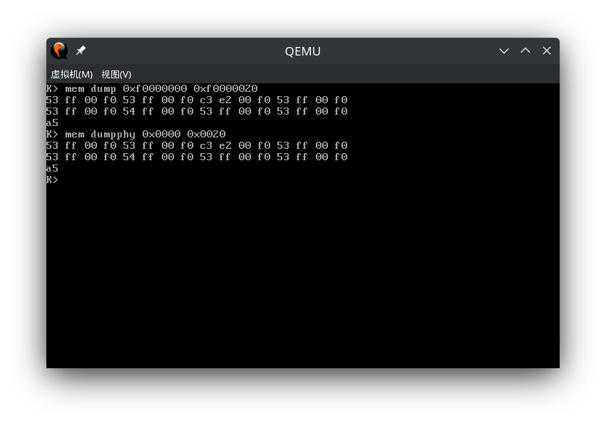

# Report for lab2, Kexing Zhou, 1900013008

[TOC]

## Environment Configuration

```
Hardware Environment:
Memory:         16GB
Processor:      Intel® Core™ i7-8550U CPU @ 1.66GHz × 8
GPU:            NVIDIA GeForce RTX 2070
OS Type:        64 bit
Disk:           924GB

Software Environment:
OS:             Arch Linux
Gcc:            Gcc 11.1.0
Make:           GNU Make 4.3
Gdb:            GNU gdb 11.1
```

### Test Compiler Toolchain

```bash
$ objdump -i   # the 5th line say elf32-i386
$ gcc -m32 -print-libgcc-file-name
/usr/lib/gcc/x86_64-pc-linux-gnu/11.1.0/32/libgcc.a
```

### QEMU Emulator
```bash
$ sudo pacman -S riscv64-linux-gnu-binutils \
    riscv64-linux-gnu-gcc riscv64-linux-gnu-gdb qemu-arch-extra
```

## Memory Management

### Exercise 1

#### pmap.c, boot_alloc
```c++
static void *
boot_alloc(uint32_t n)
{
	static char *nextfree;	// virtual address of next byte of free memory
	char *result;

	// Initialize nextfree if this is the first time.
	// 'end' is a magic symbol automatically generated by the linker,
	// which points to the end of the kernel's bss segment:
	// the first virtual address that the linker did *not* assign
	// to any kernel code or global variables.
	if (!nextfree) {
		extern char end[];
		nextfree = ROUNDUP((char *) end, PGSIZE);
	}

	// Allocate a chunk large enough to hold 'n' bytes, then update
	// nextfree.  Make sure nextfree is kept aligned
	// to a multiple of PGSIZE.

	void * ret = nextfree;
	nextfree = ROUNDUP(nextfree + n, PGSIZE);

	return ret;
}
```

#### pmap.c, mem_init
```c++
void
mem_init(void)
{
	uint32_t cr0;
	size_t n;

	// Find out how much memory the machine has (npages & npages_basemem).
	i386_detect_memory();

	// Remove this line when you're ready to test this function.

	//////////////////////////////////////////////////////////////////////
	// create initial page directory.
	kern_pgdir = (pde_t *) boot_alloc(PGSIZE);
	memset(kern_pgdir, 0, PGSIZE);

	//////////////////////////////////////////////////////////////////////
	// Recursively insert PD in itself as a page table, to form
	// a virtual page table at virtual address UVPT.
	// (For now, you don't have understand the greater purpose of the
	// following line.)

	// Permissions: kernel R, user R
	kern_pgdir[PDX(UVPT)] = PADDR(kern_pgdir) | PTE_U | PTE_P;

	//////////////////////////////////////////////////////////////////////
	// Allocate an array of npages 'end's and store it in 'pages'.
	// The kernel uses this array to keep track of physical pages: for
	// each physical page, there is a corresponding struct PageInfo in this
	// array.  'npages' is the number of physical pages in memory.  Use memset
	// to initialize all fields of each struct PageInfo to 0.
	pages = boot_alloc(sizeof(*pages) * npages);
	memset(pages, 0, sizeof(*pages) * npages);

	//////////////////////////////////////////////////////////////////////
	// Now that we've allocated the initial kernel data structures, we set
	// up the list of free physical pages. Once we've done so, all further
	// memory management will go through the page_* functions. In
	// particular, we can now map memory using boot_map_region
	// or page_insert
	page_init();

	check_page_free_list(1);
	check_page_alloc();
	check_page();

	//////////////////////////////////////////////////////////////////////
	// Now we set up virtual memory

	//////////////////////////////////////////////////////////////////////
	// Map 'pages' read-only by the user at linear address UPAGES
	// Permissions:
	//    - the new image at UPAGES -- kernel R, user R
	//      (ie. perm = PTE_U | PTE_P)
	//    - pages itself -- kernel RW, user NONE
	boot_map_region(kern_pgdir, UPAGES, PTSIZE, PADDR(pages), PTE_P | PTE_W);

	//////////////////////////////////////////////////////////////////////
	// Use the physical memory that 'bootstack' refers to as the kernel
	// stack.  The kernel stack grows down from virtual address KSTACKTOP.
	// We consider the entire range from [KSTACKTOP-PTSIZE, KSTACKTOP)
	// to be the kernel stack, but break this into two pieces:
	//     * [KSTACKTOP-KSTKSIZE, KSTACKTOP) -- backed by physical memory
	//     * [KSTACKTOP-PTSIZE, KSTACKTOP-KSTKSIZE) -- not backed; so if
	//       the kernel overflows its stack, it will fault rather than
	//       overwrite memory.  Known as a "guard page".
	//     Permissions: kernel RW, user NONE
	boot_map_region(kern_pgdir, KSTACKTOP - KSTKSIZE, KSTKSIZE, PADDR(bootstack), PTE_P | PTE_W);

	//////////////////////////////////////////////////////////////////////
	// Map all of physical memory at KERNBASE.
	// Ie.  the VA range [KERNBASE, 2^32) should map to
	//      the PA range [0, 2^32 - KERNBASE)
	// We might not have 2^32 - KERNBASE bytes of physical memory, but
	// we just set up the mapping anyway.
	// Permissions: kernel RW, user NONE
	boot_map_region(kern_pgdir, KERNBASE, -KERNBASE, 0, PTE_P | PTE_W);


	// Check that the initial page directory has been set up correctly.
	check_kern_pgdir();

	uint32_t cr4 = rcr4();
	cr4 |= CR4_PSE;
	lcr4(cr4);

	// Switch from the minimal entry page directory to the full kern_pgdir
	// page table we just created.	Our instruction pointer should be
	// somewhere between KERNBASE and KERNBASE+4MB right now, which is
	// mapped the same way by both page tables.
	//
	// If the machine reboots at this point, you've probably set up your
	// kern_pgdir wrong.
	lcr3(PADDR(kern_pgdir));

	check_page_free_list(0);

	// entry.S set the really important flags in cr0 (including enabling
	// paging).  Here we configure the rest of the flags that we care about.
	cr0 = rcr0();
	cr0 |= CR0_PE|CR0_PG|CR0_AM|CR0_WP|CR0_NE|CR0_MP;
	cr0 &= ~(CR0_TS|CR0_EM);
	lcr0(cr0);

	// Some more checks, only possible after kern_pgdir is installed.
	check_page_installed_pgdir();
}
```

#### pmap.c, page_init
```c++
void
page_init(void)
{
	// The example code here marks all physical pages as free.
	// However this is not truly the case.  What memory is free?
	//  1) Mark physical page 0 as in use.
	//     This way we preserve the real-mode IDT and BIOS structures
	//     in case we ever need them.  (Currently we don't, but...)
	//  2) The rest of base memory, [PGSIZE, npages_basemem * PGSIZE)
	//     is free.
	//  3) Then comes the IO hole [IOIOPHYSMEMPHYSMEM, EXTPHYSMEM), which must
	//     never be allocated.
	//  4) Then extended memory [EXTPHYSMEM, ...).
	//     Some of it is in use, some is free. Where is the kernel
	//     in physical memory?  Which pages are already in use for
	//     page tables and other data structures?
	//
	// Change the code to reflect this.
	// NB: DO NOT actually touch the physical memory corresponding to
	// free pages!

	page_free_list = NULL;

	for(size_t i = PGNUM(PADDR(boot_alloc(0))); i < npages; i++) {
		pages[i].pp_ref = 0;
		pages[i].pp_link = page_free_list;
		page_free_list = &pages[i];
	}
	// at system start, the lower memory is mapped into the initial pagetable
	// so I put these pages into the top of page_free_list
	for(size_t i = 1; i < npages_basemem; i++) {
		pages[i].pp_ref = 0;
		pages[i].pp_link = page_free_list;
		page_free_list = &pages[i];
	}
}

```

#### pmap.c, page_alloc
```c++
struct PageInfo *
page_alloc(int alloc_flags)
{
	if(!page_free_list)
		return NULL;
	struct PageInfo * ret = page_free_list;
	page_free_list = ret->pp_link;
	ret->pp_link = NULL;
	if(alloc_flags & ALLOC_ZERO) { 
		memset(page2kva(ret), 0, PGSIZE);
	}
	return ret;
}
```

#### pmap.c, page_free
```c++
void
page_free(struct PageInfo *pp)
{
	// Fill this function in
	// Hint: You may want to panic if pp->pp_ref is nonzero or
	// pp->pp_link is not NULL.
	if(pp->pp_ref || pp->pp_link)
		panic("page to free is already in free list\n");
	pp->pp_link = page_free_list;
	page_free_list = pp;
}
```

### Exercise 2

Nothing to report.

### Exercise 3

**Use the xp command in the QEMU monitor and the x command in GDB to inspect memory at corresponding physical and virtual addresses and make sure you see the same data.**

In QEMU

```nasm
(qemu) xp 0x100000
0000000000100000: 0x1badb002
```

In GDB:

```nasm
(gdb) p/x *0xf0100000
$1 = 0x1badb002
```

### Question
**Assuming that the following JOS kernel code is correct, what type should variable x have, uintptr_t or physaddr_t?**

It should be `uintptr_t`.

### Exercise 4

#### pmap.c, pgdir_walk
```c++
pte_t *
pgdir_walk(pde_t *pgdir, const void *va, int create) {
	pde_t pde = pgdir[PDX(va)];
	if(pde & PTE_P) {
		pte_t * ptab = KADDR(PTE_ADDR(pde));
		return &ptab[PTX(va)];
	}
	else if(create) {
		struct PageInfo * ptab_info = page_alloc(ALLOC_ZERO);
		if(ptab_info == NULL) return NULL;
		ptab_info->pp_ref++;
		physaddr_t pa = page2pa(ptab_info);
		pgdir[PDX(va)] = pa | PTE_P | PTE_U | PTE_W;
		pte_t * ptab = KADDR(pa);
		return &ptab[PTX(va)];
	}
	else return NULL;
}
```

#### pmap.c, boot_map_region
```c++
static void
boot_map_region(pde_t *pgdir, uintptr_t va, size_t size, physaddr_t pa, int perm)
{
	perm = (perm & 0x3FF) | PTE_P;
	for(size_t offset = 0; offset < size; offset += PGSIZE) {
		pte_t * ppte = pgdir_walk(pgdir, (void*)va + offset, true);
		if(ppte == NULL) panic("No Avaliable Page");
		*ppte = (pa + offset) | perm;
	}
}
```

#### pmap.c, page_lookup
```c++
struct PageInfo *
page_lookup(pde_t *pgdir, void *va, pte_t **pte_store)
{
	pte_t * pptab = pgdir_walk(pgdir, va, false);
	if(pte_store) {
		*pte_store = pptab;
	}
	if(pptab && (*pptab & PTE_P)) {
		return pa2page(PTE_ADDR(*pptab));
	}
	else {
		return NULL;
	}
}
```

#### pmap.c, page_remove
```c++
void
page_remove(pde_t *pgdir, void *va)
{
	pte_t * ppte;
	struct PageInfo * info = page_lookup(pgdir, va, &ppte);
	if(info == NULL) return;
	*ppte = 0;
	page_decref(info);
	tlb_invalidate(pgdir, va);
}
```

#### pmap.c, page_insert
```c++
int
page_insert(pde_t *pgdir, struct PageInfo *pp, void *va, int perm)
{
	perm = (perm & 0x3FF) | PTE_P;
	pte_t * ppte = pgdir_walk(pgdir, va, true);
	if(ppte == NULL) {
		return -E_NO_MEM;
	}
	physaddr_t pa = page2pa(pp);
	bool same_map = false;
	if(*ppte & PTE_P) {
		if(PTE_ADDR(*ppte) != pa) {
			page_remove(pgdir, va);
		}
		else {
			same_map = true;
		}
	}
	if(!same_map) pp->pp_ref++;
	*ppte = pa | perm;
	return 0;
}
```

### Exercise 5

**Fill in the missing code in mem_init() after the call to check_page().**
```c++
void
mem_init(void)
{
	uint32_t cr0;
	size_t n;

	// Find out how much memory the machine has (npages & npages_basemem).
	i386_detect_memory();

	// Remove this line when you're ready to test this function.

	//////////////////////////////////////////////////////////////////////
	// create initial page directory.
	kern_pgdir = (pde_t *) boot_alloc(PGSIZE);
	memset(kern_pgdir, 0, PGSIZE);

	//////////////////////////////////////////////////////////////////////
	// Recursively insert PD in itself as a page table, to form
	// a virtual page table at virtual address UVPT.
	// (For now, you don't have understand the greater purpose of the
	// following line.)

	// Permissions: kernel R, user R
	kern_pgdir[PDX(UVPT)] = PADDR(kern_pgdir) | PTE_U | PTE_P;

	//////////////////////////////////////////////////////////////////////
	// Allocate an array of npages 'end's and store it in 'pages'.
	// The kernel uses this array to keep track of physical pages: for
	// each physical page, there is a corresponding struct PageInfo in this
	// array.  'npages' is the number of physical pages in memory.  Use memset
	// to initialize all fields of each struct PageInfo to 0.
	pages = boot_alloc(sizeof(*pages) * npages);
	memset(pages, 0, sizeof(*pages) * npages);

	//////////////////////////////////////////////////////////////////////
	// Now that we've allocated the initial kernel data structures, we set
	// up the list of free physical pages. Once we've done so, all further
	// memory management will go through the page_* functions. In
	// particular, we can now map memory using boot_map_region
	// or page_insert
	page_init();

	check_page_free_list(1);
	check_page_alloc();
	check_page();

	//////////////////////////////////////////////////////////////////////
	// Now we set up virtual memory

	//////////////////////////////////////////////////////////////////////
	// Map 'pages' read-only by the user at linear address UPAGES
	// Permissions:
	//    - the new image at UPAGES -- kernel R, user R
	//      (ie. perm = PTE_U | PTE_P)
	//    - pages itself -- kernel RW, user NONE
	boot_map_region(kern_pgdir, UPAGES, PTSIZE, PADDR(pages), PTE_P | PTE_W);

	//////////////////////////////////////////////////////////////////////
	// Use the physical memory that 'bootstack' refers to as the kernel
	// stack.  The kernel stack grows down from virtual address KSTACKTOP.
	// We consider the entire range from [KSTACKTOP-PTSIZE, KSTACKTOP)
	// to be the kernel stack, but break this into two pieces:
	//     * [KSTACKTOP-KSTKSIZE, KSTACKTOP) -- backed by physical memory
	//     * [KSTACKTOP-PTSIZE, KSTACKTOP-KSTKSIZE) -- not backed; so if
	//       the kernel overflows its stack, it will fault rather than
	//       overwrite memory.  Known as a "guard page".
	//     Permissions: kernel RW, user NONE
	boot_map_region(kern_pgdir, KSTACKTOP - KSTKSIZE, KSTKSIZE, PADDR(bootstack), PTE_P | PTE_W);

	//////////////////////////////////////////////////////////////////////
	// Map all of physical memory at KERNBASE.
	// Ie.  the VA range [KERNBASE, 2^32) should map to
	//      the PA range [0, 2^32 - KERNBASE)
	// We might not have 2^32 - KERNBASE bytes of physical memory, but
	// we just set up the mapping anyway.
	// Permissions: kernel RW, user NONE
	boot_map_region(kern_pgdir, KERNBASE, -KERNBASE, 0, PTE_P | PTE_W);


	// Check that the initial page directory has been set up correctly.
	check_kern_pgdir();

	uint32_t cr4 = rcr4();
	cr4 |= CR4_PSE;
	lcr4(cr4);

	// Switch from the minimal entry page directory to the full kern_pgdir
	// page table we just created.	Our instruction pointer should be
	// somewhere between KERNBASE and KERNBASE+4MB right now, which is
	// mapped the same way by both page tables.
	//
	// If the machine reboots at this point, you've probably set up your
	// kern_pgdir wrong.
	lcr3(PADDR(kern_pgdir));

	check_page_free_list(0);

	// entry.S set the really important flags in cr0 (including enabling
	// paging).  Here we configure the rest of the flags that we care about.
	cr0 = rcr0();
	cr0 |= CR0_PE|CR0_PG|CR0_AM|CR0_WP|CR0_NE|CR0_MP;
	cr0 &= ~(CR0_TS|CR0_EM);
	lcr0(cr0);

	// Some more checks, only possible after kern_pgdir is installed.
	check_page_installed_pgdir();
}

```

### Question

#### Question 2
**What entries (rows) in the page directory have been filled in at this point? What addresses do they map and where do they point? In other words, fill out this table as much as possible:**

|   idx | va       | pa       | comment                 |
|------:|:---------|:---------|:------------------------|
|   957 | ef400000 | f011b000 | pgdir self loop         |
|   956 | ef000000 | 11c000   | maps to UPAGES          |
|   959 | efff8000 | 10f000   | maps to bootstack       |
|   960 | f0000000 | 0        | maps to physical memory |
|   961 | f0400000 | 400000   | maps to physical memory |
|   962 | f0800000 | 800000   | maps to physical memory |
|   963 | f0c00000 | c00000   | maps to physical memory |
|   964 | f1000000 | 1000000  | maps to physical memory |
|   965 | f1400000 | 1400000  | maps to physical memory |
|   966 | f1800000 | 1800000  | maps to physical memory |
|   967 | f1c00000 | 1c00000  | maps to physical memory |
|   968 | f2000000 | 2000000  | maps to physical memory |
|   969 | f2400000 | 2400000  | maps to physical memory |
|   970 | f2800000 | 2800000  | maps to physical memory |
|   971 | f2c00000 | 2c00000  | maps to physical memory |
|   972 | f3000000 | 3000000  | maps to physical memory |
|   973 | f3400000 | 3400000  | maps to physical memory |
|   974 | f3800000 | 3800000  | maps to physical memory |
|   975 | f3c00000 | 3c00000  | maps to physical memory |
|   976 | f4000000 | 4000000  | maps to physical memory |
|   977 | f4400000 | 4400000  | maps to physical memory |
|   978 | f4800000 | 4800000  | maps to physical memory |
|   979 | f4c00000 | 4c00000  | maps to physical memory |
|   980 | f5000000 | 5000000  | maps to physical memory |
|   981 | f5400000 | 5400000  | maps to physical memory |
|   982 | f5800000 | 5800000  | maps to physical memory |
|   983 | f5c00000 | 5c00000  | maps to physical memory |
|   984 | f6000000 | 6000000  | maps to physical memory |
|   985 | f6400000 | 6400000  | maps to physical memory |
|   986 | f6800000 | 6800000  | maps to physical memory |
|   987 | f6c00000 | 6c00000  | maps to physical memory |
|   988 | f7000000 | 7000000  | maps to physical memory |
|   989 | f7400000 | 7400000  | maps to physical memory |
|   990 | f7800000 | 7800000  | maps to physical memory |
|   991 | f7c00000 | 7c00000  | maps to physical memory |
|   992 | f8000000 | 8000000  | maps to physical memory |
|   993 | f8400000 | 8400000  | maps to physical memory |
|   994 | f8800000 | 8800000  | maps to physical memory |
|   995 | f8c00000 | 8c00000  | maps to physical memory |
|   996 | f9000000 | 9000000  | maps to physical memory |
|   997 | f9400000 | 9400000  | maps to physical memory |
|   998 | f9800000 | 9800000  | maps to physical memory |
|   999 | f9c00000 | 9c00000  | maps to physical memory |
|  1000 | fa000000 | a000000  | maps to physical memory |
|  1001 | fa400000 | a400000  | maps to physical memory |
|  1002 | fa800000 | a800000  | maps to physical memory |
|  1003 | fac00000 | ac00000  | maps to physical memory |
|  1004 | fb000000 | b000000  | maps to physical memory |
|  1005 | fb400000 | b400000  | maps to physical memory |
|  1006 | fb800000 | b800000  | maps to physical memory |
|  1007 | fbc00000 | bc00000  | maps to physical memory |
|  1008 | fc000000 | c000000  | maps to physical memory |
|  1009 | fc400000 | c400000  | maps to physical memory |
|  1010 | fc800000 | c800000  | maps to physical memory |
|  1011 | fcc00000 | cc00000  | maps to physical memory |
|  1012 | fd000000 | d000000  | maps to physical memory |
|  1013 | fd400000 | d400000  | maps to physical memory |
|  1014 | fd800000 | d800000  | maps to physical memory |
|  1015 | fdc00000 | dc00000  | maps to physical memory |
|  1016 | fe000000 | e000000  | maps to physical memory |
|  1017 | fe400000 | e400000  | maps to physical memory |
|  1018 | fe800000 | e800000  | maps to physical memory |
|  1019 | fec00000 | ec00000  | maps to physical memory |
|  1020 | ff000000 | f000000  | maps to physical memory |
|  1021 | ff400000 | f400000  | maps to physical memory |
|  1022 | ff800000 | f800000  | maps to physical memory |
|  1023 | ffc00000 | fc00000  | maps to physical memory |

#### Question 3
**We have placed the kernel and user environment in the same address space. Why will user programs not be able to read or write the kernel's memory?**

**What specific mechanisms protect the kernel memory?**
We map kernel memory but not set the `PTE_U` flag. 

#### Question 4
**What is the maximum amount of physical memory that this operating system can support? Why?**

4G, because the memory space is 32bit unsigned integer. The max value of a 32bit unsigned integer is $2^{32} = 4{\rm G}$ .

#### Question 5
**How much space overhead is there for managing memory, if we actually had the maximum amount of physical memory? How is this overhead broken down?**
The overhead includes $1$ pagedir and $2^10$ page tables. They cost $(2^{10}+1)\cdot \text{PAGESIZE} = 2^{22}+2^{12} = 4{\rm M}+4{\rm k}$ .

#### Question 6
**At what point do we transition to running at an EIP above KERNBASE?**

At entry.S, line 64
```nasm
	mov	$relocated, %eax
	jmp	*%eax
relocated:
```

**What makes it possible for us to continue executing at a low EIP between when we enable paging and when we begin running at an EIP above KERNBASE?**

At entrypgdir.c, line 21
```c++
pde_t entry_pgdir[NPDENTRIES] = {
	// Map VA's [0, 4MB) to PA's [0, 4MB)
	[0]
		= ((uintptr_t)entry_pgtable - KERNBASE) + PTE_P,
	// Map VA's [KERNBASE, KERNBASE+4MB) to PA's [0, 4MB)
	[KERNBASE>>PDXSHIFT]
		= ((uintptr_t)entry_pgtable - KERNBASE) + PTE_P + PTE_W
};
```

The `entry_pgdir` maps VA's [0, 4MB) to PA's [0, 4MB), so code fetch won't crash.

**Why is this transition necessary?**

Because the map from VA's [0, 4MB) to PA's [0, 4MB) is a temporary map. When the virtual memory setups competely, this map won't exists. So the transition is necessary.

### Challenge 1

We should turn on `CR4_PSE` to enable big page mode.
```c++
uint32_t cr4 = rcr4();
cr4 |= CR4_PSE;
lcr4(cr4);
```

My page mapping strategy is, in `boot_map_region`, big page is prefered.
```c++
static void
boot_map_region(pde_t *pgdir, uintptr_t va, size_t size, physaddr_t pa, int perm)
{
	perm = perm | PTE_P;
	size_t offset = 0;
	while(offset < size) {
		void * map_va = (void *)va + offset;
		physaddr_t map_pa = pa + offset;
		if(PTX(map_pa) == 0 && size - offset >= PGSIZE * NPTENTRIES) {
			pde_t * ppde = pgdir_walk_bigpg(pgdir, map_va);
			if(ppde != NULL) {
				*ppde = map_pa | perm | PTE_PS;
				offset += PGSIZE * NPTENTRIES;
				continue;
			}
		}
		if(size - offset >= PGSIZE) {
			pte_t * ppte = pgdir_walk(pgdir, map_va, true);
			if(ppte == NULL) panic("No Available Page");
			*ppte = map_pa | perm;
			offset += PGSIZE;
		}
	}
}
```

Then, in `pgdir_walk`, big pages may be split as required.
```c++
pte_t *
pgdir_walk(pde_t *pgdir, const void *va, int create) {
	pde_t * pde = &pgdir[PDX(va)];
	if(*pde & PTE_P) {
		if(*pde & PTE_PS) {
			pte_t * ptab = split_large_page(pde);
			if(ptab == NULL) panic("No Available Page");
			return &ptab[PTX(va)];
		}
		else {
			pte_t * ptab = KADDR(PDE_ADDR(*pde));
			return &ptab[PTX(va)];
		}
	}
	else if(create) {
		struct PageInfo * ptab_info = page_alloc(ALLOC_ZERO);
		if(ptab_info == NULL) return NULL;
		ptab_info->pp_ref++;
		physaddr_t pa = page2pa(ptab_info);
		*pde = pa | PTE_P | PTE_U | PTE_W;
		pte_t * ptab = KADDR(pa);
		return &ptab[PTX(va)];
	}
	else return NULL;
}
```

The code for splitting page is:
```c++
pte_t * split_large_page(pde_t * pde) {
	struct PageInfo * ptab_info = page_alloc(ALLOC_ZERO);
	if(ptab_info == NULL) return NULL;
	uint32_t flags = PDE_FLAGS(*pde) & ~PTE_PS;
	physaddr_t pa = PDE_ADDR(*pde);
	ptab_info->pp_ref++;
	physaddr_t ptab_pa = page2pa(ptab_info);
	pte_t * ptab = KADDR(ptab_pa);
	for(size_t i = 0; i < NPTENTRIES; i++) {
		ptab[i] = (pa + i * PGSIZE) | flags;
	}
	*pde = ptab_pa | PTE_P | PTE_U | PTE_W;
	return ptab;
}
```

The `check_va2pa` function is wrong when in big page mode. So I modified it:
```c++
static physaddr_t
check_va2pa(pde_t *pgdir, uintptr_t va)
{
	pte_t *p;

	pgdir = &pgdir[PDX(va)];
	if (!(*pgdir & PTE_P))
		return ~0;
	if(*pgdir & PTE_PS) {
		return PDE_ADDR(*pgdir) + PTX(va) * PGSIZE;
	}
	p = (pte_t*) KADDR(PTE_ADDR(*pgdir));
	if (!(p[PTX(va)] & PTE_P))
		return ~0;
	return PTE_ADDR(p[PTX(va)]);
}
```

### Challenge 2

I implemented the follow commands:
```bash
mem pde                        # show all pde
mem show 0x0000 0xf000         # show pages from 0x0000 to 0xf000
mem set pde 0x0000 PS 1        # set PS flag of pde at 0x0000
mem dump 0xf0000000 0xf000f000 # dump virtual memory
mem dumpphy 0x0000 0xf000      # dump physical memory
```

The command result:
```bash
mem pde
```


```bash
mem show 0xf0000000 0xf000f000
```


```bash
mem show 0x0000 0x5000
mem set pde 0x0000 PS 1
mem set pde 0x0000 P 1
mem show 0x0000 0x5000
```

* Here, I set PS flag to 1, the pages from 0x0000 to 0x5000 is in the same big page.

```bash
mem dump 0xf0000000 0xf0000020
mem dumpphy 0x0000 0x0020
```


The code is:
```c++
// --------------------------------------------------------------
// Debug functions.
// --------------------------------------------------------------

static int64_t atoi(char * arg) {
#define _isnum(x) ('0' <= (x) && (x) <= '9') || ('a' <= (x) && (x) <= 'f')
#define _getnum(x) (('0' <= (x) && (x) <= '9') ? ((x) - '0') : ((x) - 'a' + 10))
	int64_t ret = 0, mul = 1, base=10;
	while(!('0' <= *arg && *arg <= '9')) arg++;
	if(*arg == '-') { mul = -1; arg++; }
	if(arg[0] == '0') {
		if(arg[1] == 'x') {
			base = 16;
			arg = arg + 2;
		}
	}
	while(_isnum(*arg)) {
		ret = ret * base + _getnum(*arg);
		arg++;
	}
	return ret * mul;
#undef _getnum
#undef _isnum
}

static void _show_pte(pte_t pde) {
#define _show_pde_inner(flag) \
	if(pde & PTE_##flag) {cprintf(" "); cprintf(#flag);}\
	else {cprintf(" "); for(size_t i = strlen(#flag); i; i--) cprintf(" ");}
	cprintf("%08x ", PTE_ADDR(pde));
	_show_pde_inner(P);
	_show_pde_inner(PS);
	_show_pde_inner(W);
	_show_pde_inner(U); 
	_show_pde_inner(PWT); 
	_show_pde_inner(PCD); 
	_show_pde_inner(A);
	_show_pde_inner(D); 
	_show_pde_inner(G);
	_show_pde_inner(AVAIL);
#undef _show_pde_inner
}

static void _show_pde(pde_t pde) {
	_show_pte((pte_t)pde);
}

int
memcmd_pde(int argc, char ** argv, struct Trapframe * tf) {
	for(size_t i = 0; i < NPDENTRIES; i++) {
		uintptr_t va = PGSIZE * NPTENTRIES * i;
		cprintf("%08x ", va);
		_show_pde(kern_pgdir[PDX(va)]);
		cprintf("\n");
	}
	return 0;
}

int
memcmd_show(int argc, char ** argv, struct Trapframe * tf) {
	if(argc != 3) {
		cprintf("usage mem show <start> <end>\n");
		return -1;
	}
	uintptr_t start = ROUNDDOWN(atoi(argv[1]), PGSIZE);
	uintptr_t end = ROUNDUP(atoi(argv[2]) + 1, PGSIZE);
	cprintf("mapping from %08x to %08x\n", start, end - PGSIZE);
	uintptr_t va = start;
	do {
		pde_t * ppde = &kern_pgdir[PDX(va)];
		if(!(*ppde & PTE_P) || (*ppde & PTE_PS)) {
			cprintf("%08x ", va); _show_pde(*ppde); cprintf("\n");
		}
		else {
			pte_t * ppte = pgdir_walk(kern_pgdir, (void*)va, false);
			assert(ppte);
			cprintf("%08x ", va); _show_pte(*ppte); cprintf("\n");
		}
		va += PGSIZE;
	} while(va != end);
	return 0;
}

int
memcmd_set(int argc, char ** argv, struct Trapframe * tf) {
	if(argc != 5) {
		cprintf("usage mem set <pde|pte> <va> <ent> <value>\n");
		return -1;
	}
	bool pde = strcmp(argv[1], "pde") == 0;
	uintptr_t va = atoi(argv[2]);
	const char * ent = argv[3];
	uint64_t value = atoi(argv[4]);
#define _memcmd_set_inner(flag) \
	else if(strcmp(ent, #flag)==0) {\
		if(pde) {\
			pde_t * ppde = &kern_pgdir[PDX(va)]; \
			*ppde = (*ppde & (~PTE_##flag)) | (value * PTE_##flag);\
		} \
		else    {\
			pte_t * ppte = pgdir_walk(kern_pgdir, (void*)va, true); \
			if(ppte == NULL) {cprintf("No Available Pages"); \
				return -1; \
			} \
			*ppte = (*ppte & (~PTE_##flag)) | (value * PTE_##flag); \
		} \
	}
	if(strcmp(ent, "pa")==0) {
		if(pde) {
			pde_t * ppde = &kern_pgdir[PDX(va)];
			*ppde = value | PDE_FLAGS(*ppde);
			tlb_invalidate(kern_pgdir, (void*)va);
		}
		else {
			pte_t * ppte = pgdir_walk(kern_pgdir, (void*)va, true);
			*ppte = value | PTE_FLAGS(*ppte);
			tlb_invalidate(kern_pgdir, (void*)va);
		}
	}
	_memcmd_set_inner(P)
	_memcmd_set_inner(PS)
	_memcmd_set_inner(W)
	_memcmd_set_inner(U) 
	_memcmd_set_inner(PWT) 
	_memcmd_set_inner(PCD) 
	_memcmd_set_inner(A)
	_memcmd_set_inner(D) 
	_memcmd_set_inner(G)
	_memcmd_set_inner(AVAIL)
	else {
		cprintf("Unknown entity: %s\n", ent);
		return -1;
	}
	return 0;
}

int 
memcmd_dump(int argc, char ** argv, struct Trapframe * tf) {
	if(argc != 3) {
		cprintf("usage mem dump <start> <end>\n");
		return -1;
	}
	uintptr_t start = atoi(argv[1]);
	uintptr_t end = atoi(argv[2]);
	short tick = 0;
	for(uintptr_t i = start; i <= end; i++) {
		cprintf("%02x ", *(unsigned char *)i);
		if(((++tick)&0xf)==0) cprintf("\n");
	}
	if(tick)cprintf("\n");
	return 0;
}

int 
memcmd_dumpphy(int argc, char ** argv, struct Trapframe * tf) {
	if(argc != 3) {
		cprintf("usage mem dumpphy <start> <end>\n");
		return -1;
	}
	uintptr_t start = atoi(argv[1]);
	uintptr_t end = atoi(argv[2]);
	short tick = 0;
	for(uintptr_t i = start; i <= end; i++) {
		cprintf("%02x ", *(unsigned char*)KADDR(i));
		if(((++tick)&0xf)==0) cprintf("\n");
	}
	if(tick)cprintf("\n");
	return 0;
}

int
mem_memcmd(int argc, char ** argv, struct Trapframe * tf) {
	if(argc == 1) {
		cprintf("Usage: mem <pde|show|set|dump|dumpphy> ...");
		return -1;
	}
	else {
		if(strcmp(argv[1], "pde") == 0) {
			memcmd_pde(argc - 1, argv + 1, tf);
		}
		else if(strcmp(argv[1], "show") == 0) {
			memcmd_show(argc - 1, argv + 1, tf);
		}
		else if(strcmp(argv[1], "set") == 0) {
			memcmd_set(argc - 1, argv + 1, tf);
		}
		else if(strcmp(argv[1], "dump") == 0) {
			memcmd_dump(argc - 1, argv + 1, tf);
		}
		else if(strcmp(argv[1], "dumpphy") == 0) {
			memcmd_dumpphy(argc - 1, argv + 1, tf);
		}
		else {
			cprintf("Unknown command %s\n", argv[1]);
			return -1;
		}
	}
	return 0;
}
```