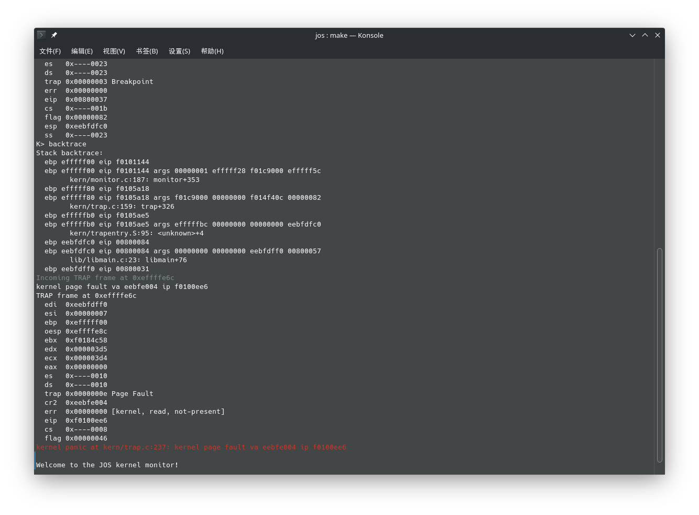
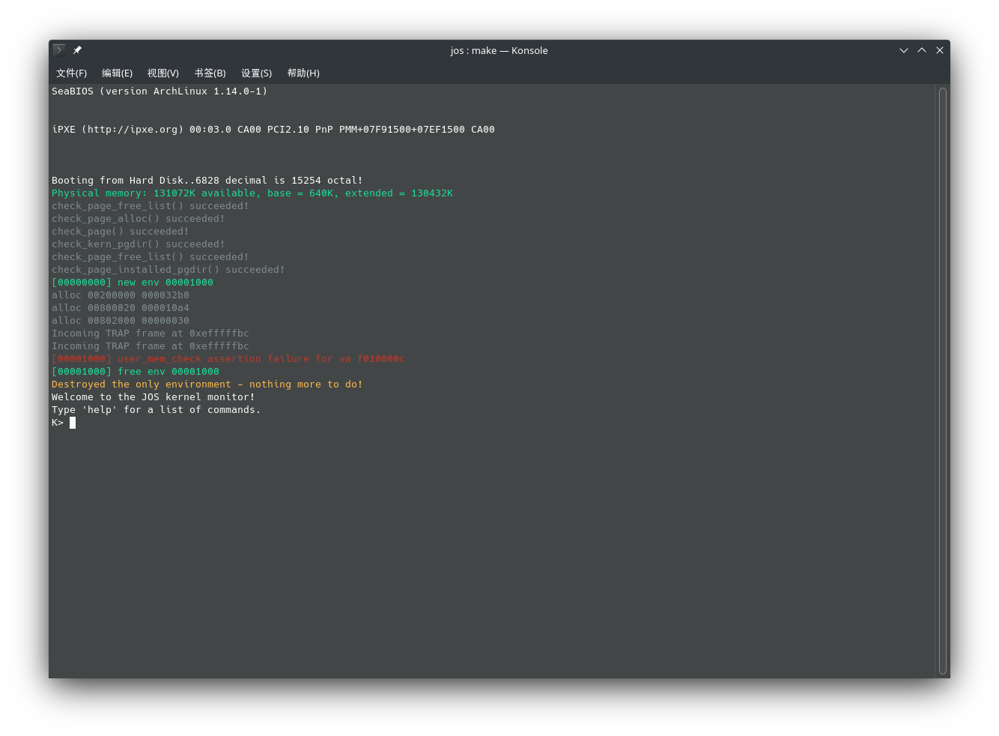

# Report for lab3, Kexing Zhou, 1900013008

[TOC]

## Environment Configuration

```
Hardware Environment:
Memory:         16GB
Processor:      Intel® Core™ i7-8550U CPU @ 1.66GHz × 8
GPU:            NVIDIA GeForce RTX 2070
OS Type:        64 bit
Disk:           924GB

Software Environment:
OS:             Arch Linux
Gcc:            Gcc 11.1.0
Make:           GNU Make 4.3
Gdb:            GNU gdb 11.1
```

### Test Compiler Toolchain

```bash
$ objdump -i   # the 5th line say elf32-i386
$ gcc -m32 -print-libgcc-file-name
/usr/lib/gcc/x86_64-pc-linux-gnu/11.1.0/32/libgcc.a
```

### QEMU Emulator
```bash
$ sudo pacman -S riscv64-linux-gnu-binutils \
    riscv64-linux-gnu-gcc riscv64-linux-gnu-gdb qemu-arch-extra
```

## Memory Management

### Exercise 1

The setup code in kern/pmap.c, Line 196.
```cpp
// allocating the pages array 
envs = boot_alloc(NENV * sizeof(*envs));
memset(envs, 0, NENV * sizeof(*envs));
......
// map envs to UENVS with permission user readonly
boot_map_region(kern_pgdir, UENVS, PTSIZE, PADDR(envs), PTE_P | PTE_U);
```

### Exercise 2

#### env_init
```cpp
void
env_init(void) {
	// Set up envs array
	// make sure the first free env is env 0
	env_free_list = &envs[0];
	for(size_t i = 0; i + 1 < NENV; i++) {
		envs[i].env_link = &envs[i + 1];
	}
	// Per-CPU part of the initialization
	env_init_percpu();
}
```

#### env_setup_vm
```cpp
static int
env_setup_vm(struct Env *e) {
	int i;
	struct PageInfo *p = NULL;

	// Allocate a page for the page directory
	if (!(p = page_alloc(ALLOC_ZERO)))
		return -E_NO_MEM;

	// use kern_pgdir as a template to initialize env
	memcpy(page2kva(p), kern_pgdir, PGSIZE);
	p->pp_ref++;
	e->env_pgdir = page2kva(p);
	
	// UVPT maps the env's own page table read-only.
	// Permissions: kernel R, user R
	e->env_pgdir[PDX(UVPT)] = PADDR(e->env_pgdir) | PTE_P | PTE_U;

	return 0;
}
```

#### region_alloc
```cpp
static void
region_alloc(struct Env *e, void *va, size_t len) {
	uintptr_t start = ROUNDDOWN((uintptr_t)va, PGSIZE);
	uintptr_t end   = ROUNDUP((uintptr_t)va + len, PGSIZE);
	int errno = 0;
	for(uintptr_t i = start; i != end; i += PGSIZE) {
		struct PageInfo * pp = page_alloc(0);
		if(pp == NULL) 
			panic("page_alloc failed: %e", -E_NO_MEM);
		if((errno = page_insert(e->env_pgdir, pp, (void*)i, PTE_P | PTE_W | PTE_U)) < 0)
			panic("page_insert failed: %e", errno);
	}
}
```

#### load_icode
```cpp

static void
region_copy(struct Env *e, void *dst, void *src, size_t len) {
	uint32_t cr3 = rcr3();
	// load the env's pgdir to copy page
	lcr3(PADDR(e->env_pgdir));
	if(src) memcpy(dst, src, len);
	else memset(dst, 0, len);
	lcr3(cr3);
}

static void
load_icode(struct Env *e, uint8_t *binary) {
	struct Elf * eh = (struct Elf *)(binary);
	assert(eh->e_magic == ELF_MAGIC);

	struct Proghdr * ph_start = (struct Proghdr*)(binary + eh->e_phoff);
	for(size_t i = 0; i < eh->e_phnum; i++) {
		struct Proghdr * ph = ph_start + i;
		if(ph->p_type != ELF_PROG_LOAD) continue;
		void * va = (void*)ph->p_va;
		region_alloc(e, va, ph->p_memsz);
		region_copy(e, va, binary + ph->p_offset, ph->p_filesz);
		if(ph->p_filesz < ph->p_memsz) { // fill rest memory with zero
			region_copy(e, va + ph->p_filesz, 0, ph->p_memsz - ph->p_filesz);
		}
	}
	e->env_tf.tf_eip = eh->e_entry;
	
	// Now map one page for the program's initial stack
	// at virtual address USTACKTOP - PGSIZE.
	region_alloc(e, (void*)(USTACKTOP - PGSIZE), PGSIZE);
}
```

#### env_create
```cpp
void
env_create(uint8_t *binary, enum EnvType type)
{
	struct Env * e;
	int errno;
	if((errno = env_alloc(&e, 0)) < 0) 
		panic("env_alloc failed: %e", errno);
	e->env_type = type;
	load_icode(e, binary);
}
```

#### env_run
```cpp

void
env_run(struct Env *e) {
	// change the state of curenv
	if(curenv && curenv->env_status == ENV_RUNNING) {
		curenv->env_status = ENV_RUNNABLE;
	}
	curenv = e;
	curenv->env_status = ENV_RUNNING;
	curenv->env_runs++;

	// Use lcr3() to switch to its address space
	lcr3(PADDR(curenv->env_pgdir));

	// switch to environment
	env_pop_tf(&(curenv->env_tf));
}
```

### Exercise 3

nothing to report.

### Exercise 4 & Challenge 1

I modified the `PLACEHANDLER` macro to place trap message in `.data` segmeng. The message contains functoin name, trap number, privilege level. 
```cpp

// The Privilege Level
#define PL_KERNEL    0
#define PL_DEVDRI1   1
#define PL_DEVDRI2   2
#define PL_USER      3

#define TRAPHANDLER(name, num, dpl)						\
	.globl name;		/* define global symbol for 'name' */	\
	.type name, @function;	/* symbol type is function */		\
	.align 2;		/* align function definition */		\
	.text; \
	name:			/* function starts here */		\
	pushl $(num);							\
	jmp _alltraps; \
	.data; .int name; .int num; .int dpl;

#define TRAPHANDLER_NOEC(name, num, dpl)					\
	.globl name;							\
	.type name, @function;						\
	.align 2;							\
	.text; \
	name:								\
	pushl $0;							\
	pushl $(num);							\
	jmp _alltraps; \
	.data; .int name; .int num; .int dpl;
```

The table entry is at a very begining, followed by the trap handler.
```nasm
.data
.global trapentry_table
trapentry_table:

.text
	TRAPHANDLER_NOEC(  trap_hander_DIVIDE   ,  T_DIVIDE   ,  PL_KERNEL  )
	TRAPHANDLER_NOEC(  trap_hander_DEBUG    ,  T_DEBUG    ,  PL_KERNEL  )
	TRAPHANDLER_NOEC(  trap_hander_NMI      ,  T_NMI      ,  PL_KERNEL  )
	TRAPHANDLER_NOEC(  trap_hander_BRKPT    ,  T_BRKPT    ,  PL_USER    )
	TRAPHANDLER_NOEC(  trap_hander_OFLOW    ,  T_OFLOW    ,  PL_KERNEL  )
	TRAPHANDLER_NOEC(  trap_hander_BOUND    ,  T_BOUND    ,  PL_KERNEL  )
	TRAPHANDLER_NOEC(  trap_hander_ILLOP    ,  T_ILLOP    ,  PL_KERNEL  )
	TRAPHANDLER_NOEC(  trap_hander_DEVICE   ,  T_DEVICE   ,  PL_KERNEL  )
	TRAPHANDLER     (  trap_hander_DBLFLT   ,  T_DBLFLT   ,  PL_KERNEL  )
	TRAPHANDLER     (  trap_hander_TSS      ,  T_TSS      ,  PL_KERNEL  )
	TRAPHANDLER     (  trap_hander_SEGNP    ,  T_SEGNP    ,  PL_KERNEL  )
	TRAPHANDLER     (  trap_hander_STACK    ,  T_STACK    ,  PL_KERNEL  )
	TRAPHANDLER     (  trap_hander_GPFLT    ,  T_GPFLT    ,  PL_KERNEL  )
	TRAPHANDLER     (  trap_hander_PGFLT    ,  T_PGFLT    ,  PL_KERNEL  )
	TRAPHANDLER_NOEC(  trap_hander_FPERR    ,  T_FPERR    ,  PL_KERNEL  )
	TRAPHANDLER_NOEC(  trap_hander_ALIGN    ,  T_ALIGN    ,  PL_KERNEL  )
	TRAPHANDLER_NOEC(  trap_hander_MCHK     ,  T_MCHK     ,  PL_KERNEL  )
	TRAPHANDLER_NOEC(  trap_hander_SIMDERR  ,  T_SIMDERR  ,  PL_KERNEL  )

	TRAPHANDLER_NOEC(  trap_hander_SYSCALL  ,  T_SYSCALL  ,  PL_USER    )

.data
	.int 0; .int 0; .int 0;
```

Three `.int 0` is put at the ending, to tell `trap_init` where the table ends. The `trap_init` function is very simple:

```cpp
void
trap_init(void) {
	extern struct Segdesc gdt[];

	extern uint32_t trapentry_table[];
	for(size_t i = 0; trapentry_table[i]; i += 3) {
		// extract functoin name, trap number, privilege level
		uintptr_t func_addr = trapentry_table[i];
		int trap_no = trapentry_table[i + 1];
		int dpl = trapentry_table[i + 2];
		SETGATE(idt[trap_no], 1, GD_KT, func_addr, dpl);
	}

	// Per-CPU setup 
	trap_init_percpu();
}
```

### Questoin 1

**What is the purpose of having an individual handler function for each exception/interrupt?**

Some traps may push an extra `errcode` into stack frame. We implement individual handler to organise the different stack frames into a uniform `Trapframe`, then switch to C code.

**if all exceptions/interrupts were delivered to the same handler, what feature that exists in the current implementation could not be provided?**

If don't do this, the handler doesn't know whether the code in stack top is an `errcode` or saved registers. He will fail to get the execution context in the trap.

**Did you have to do anything to make the user/softint program behave correctly?**
When user want to use `int` command to make a software interrupt, his privilege level must be equal to or less than the level of that trap. Among all the traps, only `BRKPT` and `SYSCALL` can be induced by user, so their privilege level is 3, which equals to the user's privilege level.

### Exercise 5 & Exercise 6 & Exercise 7

The trap dispatch function:
```cpp
static void
trap_dispatch(struct Trapframe *tf) {
	switch (tf->tf_trapno) {
		case T_DEBUG: monitor(tf); break;
		case T_PGFLT: page_fault_handler(tf); break;
		case T_BRKPT: monitor(tf); break;
		case T_SYSCALL: 
			// The system call number will go in %eax, 
			// and the arguments (up to five of them) will go in %edx, %ecx, %ebx, %edi, and %esi, respectively.
			// The kernel passes the return value back in %eax.
			tf->tf_regs.reg_eax = syscall(
				tf->tf_regs.reg_eax,
				tf->tf_regs.reg_edx, tf->tf_regs.reg_ecx, tf->tf_regs.reg_ebx,
				tf->tf_regs.reg_edi, tf->tf_regs.reg_esi
			);
			env_run(curenv);
			break;
		default: break;
	}

	// Unexpected trap: The user process or the kernel has a bug.
	print_trapframe(tf);
	if (tf->tf_cs == GD_KT)
		panic("unhandled trap in kernel");
	else {
		env_destroy(curenv);
		return;
	}
}
```

### Challenge 2

The the `TF` flag in `eflags` register is set to 1, the processor goes into Trap Mode. In Trap Mode, after each assembly code is executed, the processer will cause a `DEBUG` interrupt.

So I set the flag to 1, to enable step debug. And clear it to 0, to continue the program.

```cpp
int
mon_debug(int argc, char **argv, struct Trapframe * tf) {
	if(argc > 1) {
		if(tf->tf_trapno != T_BRKPT) {
			cprintf("Trap is not a breakpoint, continuing.\n");
		}
		char * cmd = argv[1];
		if(strcmp(cmd, "si") == 0) {
			tf->tf_eflags |= FL_TF; // step one code
			env_run(curenv);
		}
		else if(strcmp(cmd, "c") == 0) {
			tf->tf_eflags &= ~FL_TF; // continuing
			env_run(curenv);
		}
	}
	cprintf("Usage: debug <si|c>\n");
	return 0;
}
```

And the code in `syscall`

```cpp
static void
sys_cputs(const char *s, size_t len) {
	if(user_mem_check(curenv, s, len, PTE_U) < 0) {
		env_destroy(curenv);
	}
	else {
		cprintf("%.*s", len, s);
	}
}

int32_t
syscall(uint32_t syscallno, uint32_t a1, uint32_t a2, uint32_t a3, uint32_t a4, uint32_t a5)
{
	int32_t ret = 0;
	switch (syscallno) {
		case SYS_cgetc:       ret = sys_cgetc(); break;
		case SYS_cputs:             sys_cputs((const char *)a1, a2); break;
		case SYS_env_destroy: ret = sys_env_destroy(a1); break;
		case SYS_getenvid:    ret = sys_getenvid(); break;
		default:              ret = -E_INVAL; break;
	}
	return ret;
}
```

### Questions 2

**The break point test case will either generate a break point exception or a general protection fault depending on how you initialized the break point entry in the IDT (i.e., your call to SETGATE from trap_init). Why?**

*explained in Question 1.*

The break point interrupt is a software interrupt -- `int 3`. When user want to use `int` command to make a software interrupt, his privilege level must be equal to or less than the level of that trap.

**How do you need to set it up in order to get the breakpoint exception to work as specified above and what incorrect setup would cause it to trigger a general protection fault?**

Set the privilege level to 3. Which is user privilege level in JOS.

**What do you think is the point of these mechanisms, particularly in light of what the user/softint test program does?**

I think this facility prevents user generating some hardware interrupt (such as Timer, BIOS, Security Chips...), to protect the system.

### Exercise 8

The code in `libmain`

```cpp
void
libmain(int argc, char **argv) {
	// set thisenv to point at our Env structure in envs[].
	thisenv = envs + ENVX(sys_getenvid());

	// save the name of the program so that panic() can use it
	if (argc > 0)
		binaryname = argv[0];

	// call user main routine
	umain(argc, argv);

	// exit gracefully
	exit();
}
```

### Exercise 9

```cpp

void
page_fault_handler(struct Trapframe *tf)
{
	uint32_t fault_va;

	// Read processor's CR2 register to find the faulting address
	fault_va = rcr2();

	// Handle kernel-mode page faults.

	// LAB 3: Your code here.
	if(tf->tf_es == GD_KD && tf->tf_ds == GD_KD) {
		cprintf("kernel page fault va %08x ip %08x\n", fault_va, tf->tf_eip);
		print_trapframe(tf);
		panic("kernel page fault va %08x ip %08x\n", fault_va, tf->tf_eip);
	}

	// We've already handled kernel-mode exceptions, so if we get here,
	// the page fault happened in user mode.

	// Destroy the environment that caused the fault.
	cprintf("[%08x] user fault va %08x ip %08x\n",
		curenv->env_id, fault_va, tf->tf_eip);
	print_trapframe(tf);
	env_destroy(curenv);
}
```

In my implementations, I found the assembly code of function `umain` is mysterious:
```nasm
00800033 <umain>:
void
umain(int argc, char **argv)
{
	asm volatile("int $3");
  800033:	cc                   	int3   
}
  800034:	c3                   	ret    
```

There isn't `push %ebp` and `mov %esp,%ebp`, so the `backtrace` won't work correctly. I made a fix by adding

```cpp

void
umain(int argc, char **argv)
{
	asm volatile("push %ebp");
	asm volatile("mov %esp, %ebp");
	//..... the following code
}
```

It works well:



There is a `pagefault` in the figure, that is because the `backtrace` will look up to 4 parameters above the stack. But when it traces at `lib/entry.S`, i.e. the user environment init code whose stack is `USTACKTOP`, he will watch 4 parameters above `USTACKTOP`. These page is not mapped, so a `pagefault` is generated.

### Exercise 10

It works perfectly:
