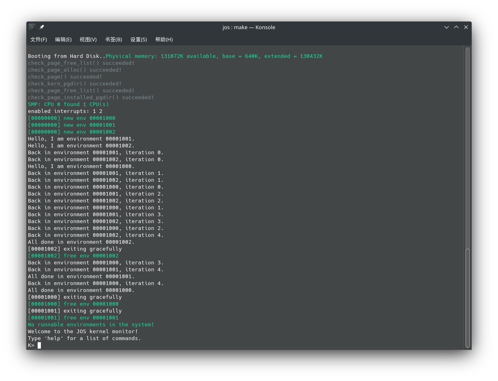
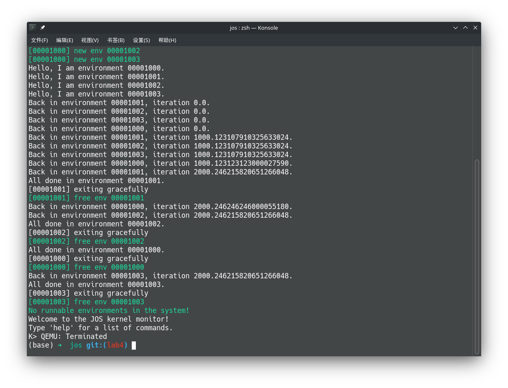
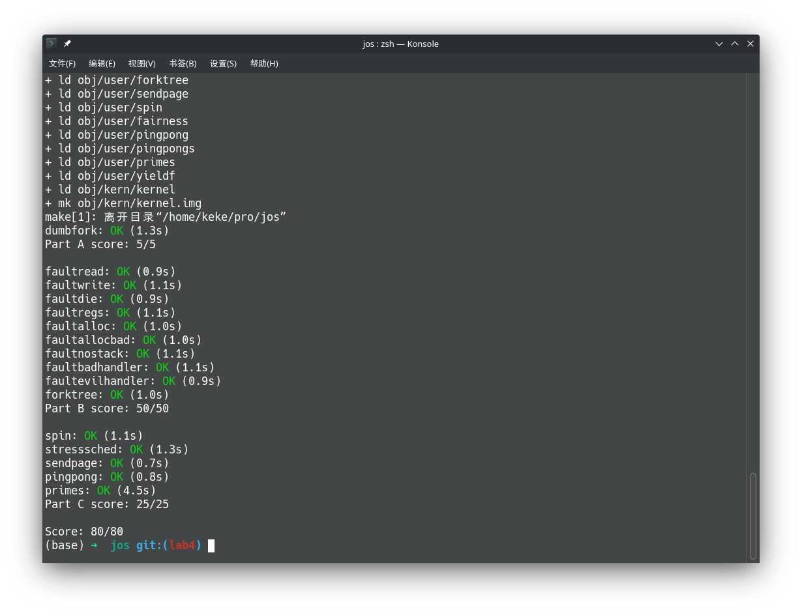

# Report for lab4, Kexing Zhou, 1900013008

## Environment Configuration

```
Hardware Environment:
Memory:         16GB
Processor:      Intel Core i7-8550U CPU @ 1.66GHz 8
GPU:            NVIDIA GeForce RTX 2070
OS Type:        64 bit
Disk:           924GB

Software Environment:
OS:             Arch Linux
Gcc:            Gcc 11.1.0
Make:           GNU Make 4.3
Gdb:            GNU gdb 11.1
```

### Test Compiler Toolchain

```bash
$ objdump -i   # the 5th line say elf32-i386
$ gcc -m32 -print-libgcc-file-name
/usr/lib/gcc/x86_64-pc-linux-gnu/11.1.0/32/libgcc.a
```

### QEMU Emulator
```bash
$ sudo pacman -S riscv64-linux-gnu-binutils \
    riscv64-linux-gnu-gcc riscv64-linux-gnu-gdb qemu-arch-extra
```

## Preemptive Multitasking

### Exercise 1

```cpp
void *
mmio_map_region(physaddr_t pa, size_t size)
{
	size = ROUNDUP(size, PGSIZE);
	boot_map_region(kern_pgdir, base, size, pa, PTE_P | PTE_PCD | PTE_PWT | PTE_W);
	uintptr_t ret = base;
	base += size;
	return (void*)ret;
}
```

### Exercise 2

```cpp
for(size_t i = 1; i < npages_basemem; i++) {
    if(i == PGNUM(MPENTRY_PADDR)) continue; // This code ignores MPENTRY
    pages[i].pp_ref = 0;
    pages[i].pp_link = page_free_list;
    page_free_list = &pages[i];
}
```

### Question 1

**What is the purpose of macro MPBOOTPHYS?**

The code which initialize MP is not linked at program position MPENTRY_PADDR, but is loaded there. So the address of each variable need to be translated from the place it is linked to the MPENTRY_PADDR. MPBOOTPHYS just did the translation staticly.

**Why is it necessary in kern/mpentry.S but not in boot/boot.S?**

The `boot/boot.S` has already placed in 0x7000. It dosen't need the translation.

**What could go wrong if it were omitted in kern/mpentry.S?**

The address of each variable is wrong, then the MP fails to start up.

### Exercise 3

```cpp
for(size_t i = 0; i < NCPU; i++) {
    uintptr_t kstacktop_i = KSTACKTOP - i * (KSTKSIZE + KSTKGAP);
    boot_map_region(kern_pgdir, kstacktop_i - KSTKSIZE, KSTKSIZE, PADDR(percpu_kstacks[i]), PTE_P|PTE_W);
}
```

### Exercise 4

```cpp
void
trap_init_percpu(void) {
	int cpuid = cpunum();
	struct Taskstate * ts = &(thiscpu->cpu_ts);

	ts->ts_esp0 = KSTACKTOP - cpuid * (KSTKSIZE + KSTKGAP);
	ts->ts_ss0  = GD_KD;
	ts->ts_iomb = sizeof(struct Taskstate);

	// Initialize the TSS slot of the gdt.
	size_t gdt_idx = (GD_TSS0 >> 3) + cpuid;
	gdt[gdt_idx] = SEG16(STS_T32A, (uint32_t) ts, sizeof(struct Taskstate) - 1, 0);
	gdt[gdt_idx].sd_s = 0;

	ltr(gdt_idx << 3);

	// Load the IDT
	lidt(&idt_pd);
}
```

### Exercise 5

The `lock_kernel` is called at:

```cpp
void
i386_init(void) {
// ..............
	pic_init();
	lock_kernel();
	boot_aps();
// ..............
}
```

```cpp
void
mp_main(void) {
// ..............
	xchg(&thiscpu->cpu_status, CPU_STARTED);
	lock_kernel();
	sched_yield();
// ..............
}
```

```cpp
void
trap(struct Trapframe *tf)
{
// ...............
	// Re-acqurie the big kernel lock if we were halted in
	// sched_yield()
	if (xchg(&thiscpu->cpu_status, CPU_STARTED) == CPU_HALTED)
		lock_kernel();
	assert(!(read_eflags() & FL_IF));

	if ((tf->tf_cs & 3) == 3) {
		// Trapped from user mode.
		// Acquire the big kernel lock before doing any
		// serious kernel work.
		// LAB 4: Your code here.
		assert(curenv);
		lock_kernel();
// ...............
    }
}
```

The `unlock_kernel` is called at:

```cpp
void
sched_halt(void) {
// ................

	// Release the big kernel lock as if we were "leaving" the kernel
	unlock_kernel();

	// Reset stack pointer, enable interrupts and then halt.
	asm volatile (
		"movl $0, %%ebp\n"
		"movl %0, %%esp\n"
		"pushl $0\n" ......
}
```

```cpp
void
env_run(struct Env *e) {
	// LAB 3: Your code here.
	assert(e->env_tf.tf_eflags & FL_IF);
	unlock_kernel();
	env_pop_tf(&(curenv->env_tf));
}
```

### Question 2

**It seems that using the big kernel lock guarantees that only one CPU can run the kernel code at a time. Why do we still need separate kernel stacks for each CPU? Describe a scenario in which using a shared kernel stack will go wrong, even with the protection of the big kernel lock.**

Two CPU receive exception at the same time. They both need to push execution context into memory, then acquires the big kernel lock. They share the stack so the context crashes. And the kernel fail to get execution context.

### Exercise 6

```cpp
void
sched_yield(void) {
	size_t env_id = curenv ? ENVX(curenv->env_id) : 0;
	size_t i = env_id;
	do {
		if(envs[i].env_status == ENV_RUNNABLE) {
			env_run(&envs[i]);
		}
		if(++i == NENV) i = 0;
	} while(i != env_id);
	if(curenv && (curenv->env_status == ENV_RUNNABLE || curenv->env_status == ENV_RUNNING)) {
		env_run(curenv);
	}
	sched_halt();
}
```



### Question 3

**Why can the pointer e be dereferenced both before and after the addressing switch?**

Pointer $e$ is stored in kernel stack, and where it points is in kernel memory. Since all environment share the same kernel memory mapping, the pointer e is dereferenced after addressing switch.

**It must ensure the old environment's registers are saved so they can be restored properly later. Why?**

The register contains context information such as stack pointer, program counter, and the current used data, which is critical for program running.

**Where does this happen?**

It happens in `kern/trap.c`, in function `trap`

```cpp
	if ((tf->tf_cs & 3) == 3) {
        //..............
		// Copy trap frame (which is currently on the stack)
		// into 'curenv->env_tf', so that running the environment
		// will restart at the trap point.
		curenv->env_tf = *tf;
		// The trapframe on the stack should be ignored from here on.
		tf = &curenv->env_tf;
	}
```

### Challenge 3

First, the FPU should be enabled:

In `entry.S` and `mpentry.S`: 

```nasm
# Turn on paging.
movl	%cr0, %eax
# CR0_MP enable x87 co-processor
orl	$(CR0_PE|CR0_PG|CR0_WP|CR0_MP), %eax
movl	%eax, %cr0

# CR4_OSFXSR enable FXSAVE and FXRSTOR instructions
# CR4_OSXMMEXCPT enable Unmasked SIMD Floating-Point Exceptions 
movl    %cr4, %eax
orl $(CR4_OSFXSR|CR4_OSXMMEXCPT), %eax
movl    %eax, %cr4
```

The command `fxsave` and `fxrstor` need 512byte aligned space to save the registers. So in env.c:

```cpp
typedef uint8_t Fxbuf[512];
Fxbuf * fxbufs = NULL;
```

And `pmap.c`

```cpp
fxbufs = boot_alloc(NENV * sizeof(*fxbufs));
memset(fxbufs, 0, NENV * sizeof(*fxbufs));
```

Then update the code of trap to save and store registers, in `trap.c`

```cpp
	if ((tf->tf_cs & 3) == 3) {
		// Trapped from user mode.
		
		assert(curenv);
		lock_kernel();

		// save registers
		asm volatile ("fxsave %0"::"m"(fxbufs[curenv->env_id])); 

		// ...........
	}
```

In `env.c`

```cpp
	assert(e->env_tf.tf_eflags & FL_IF);
	
	asm volatile ("fxrstor %0"::"m"(fxbufs[curenv->env_id]));

	unlock_kernel();
	env_pop_tf(&(curenv->env_tf));
```

I implemented a `yieldf.c` to test the fpu:

```cpp
#include <inc/lib.h>

void
umain(int argc, char **argv) {
    for(int i = 0; i < 3; i++) {
        if(fork() == 0) break;
    }
	cprintf("Hello, I am environment %08x.\n", thisenv->env_id);
	for (int i = 0; i < 3; i++) {
		sys_yield();
		cprintf("Back in environment %08x, iteration %f.\n",
			thisenv->env_id, i * 1000.123123123);
	}
	cprintf("All done in environment %08x.\n", thisenv->env_id);
}
```

It works perfectly.



### Exercise 7

```cpp
static envid_t
sys_exofork(void) {
	struct Env * e;
	ckret(env_alloc(&e, curenv->env_id));
	e->env_status = ENV_NOT_RUNNABLE;
	e->env_tf = curenv->env_tf;
	e->env_tf.tf_regs.reg_eax = 0; // child returns 0
	return e->env_id;
}

static int
sys_env_set_status(envid_t envid, int status) {
	if(status < 0 || status >= ENV_STATUS_MAX)
		return -E_INVAL;
	int errno = 0;
	struct Env * e;
	if((errno = envid2env(envid, &e, true)) < 0) {
		return errno;
	}
	e->env_status = status;
	return 0;
}

static int
usr_mem_va_check(void * va) {
	if((uintptr_t)va >= UTOP) return -E_INVAL;
	if(PGOFF(va) != 0) return -E_INVAL;
	return 0;
}

static int
usr_mem_perm_check(int perm) {
	if((perm & PTE_SYSCALL) != perm) return -E_INVAL;
	if(!(perm & PTE_U)) return -E_INVAL;
	if(!(perm & PTE_P)) return -E_INVAL;
	return 0;
}

static int
sys_page_alloc(envid_t envid, void *va, int perm) {
	struct Env * e;
	ckret(envid2env(envid, &e, true));
	struct PageInfo * pg = page_alloc(0);
	if(pg == NULL) return -E_NO_MEM;
	ckret(usr_mem_perm_check(perm));
	ckret(page_insert(e->env_pgdir, pg, va, perm));
	return 0;
}

static int
sys_page_map(envid_t srcenvid, void *srcva, envid_t dstenvid, void *dstva, int perm){
	struct Env * src, * dst;
	ckret(envid2env(srcenvid, &src, true));
	ckret(envid2env(dstenvid, &dst, true));
	ckret(usr_mem_va_check(srcva));
	ckret(usr_mem_va_check(dstva));
	ckret(usr_mem_perm_check(perm));
	pte_t * srcpte = pgdir_walk(src->env_pgdir, srcva, false);
	if(srcpte == NULL) return -E_INVAL;
	if((perm & PTE_W) && !(*srcpte & PTE_W)) return -E_INVAL;
	ckret(page_insert(dst->env_pgdir, pa2page(PTE_ADDR(*srcpte)), dstva, perm));
	return 0;
}

static int
sys_page_unmap(envid_t envid, void *va) {
	struct Env * e;
	ckret(envid2env(envid, &e, true));
	page_remove(e->env_pgdir, va);
	return 0;
}

int32_t
syscall(uint32_t syscallno, uint32_t a1, uint32_t a2, uint32_t a3, uint32_t a4, uint32_t a5) {
	int32_t ret = 0;
	switch (syscallno) {
		case SYS_cgetc:       ret = sys_cgetc(); break;
		case SYS_cputs:             sys_cputs((const char *)a1, a2); break;
		case SYS_env_destroy: ret = sys_env_destroy(a1); break;
		case SYS_getenvid:    ret = sys_getenvid(); break;
		case SYS_yield:       sched_yield(); break;
		case SYS_exofork:     ret = sys_exofork(); break;
		case SYS_env_set_status:ret=sys_env_set_status((envid_t)a1, (int)a2); break;
		case SYS_page_alloc:  ret = sys_page_alloc((envid_t)a1, (void*)a2, (int)a3); break;
		case SYS_page_map:    ret = sys_page_map((envid_t)a1, (void*)a2, (envid_t)(a3), (void*)(a4), (int)a5); break;
		case SYS_page_unmap:  ret = sys_page_unmap((envid_t)a1, (void*)a2); break;
		case SYS_env_set_pgfault_upcall: ret = sys_env_set_pgfault_upcall((envid_t)a1, (void*)a2); break;
		case SYS_ipc_try_send:ret = sys_ipc_try_send((envid_t)a1, (uint32_t)a2, (void*)a3, (unsigned int)a4); break;
		case SYS_ipc_recv:    ret = sys_ipc_recv((void*)a1); break;
		default:              ret = -E_INVAL; break;
	}
	return ret;
}
```

### Exercise 8

```cpp
static int
sys_env_set_pgfault_upcall(envid_t envid, void *func) {
	struct Env * e;
	ckret(envid2env(envid, &e, true));
	e->env_pgfault_upcall = func;
	return 0;
}
```

### Exercise 9

```cpp
	if(curenv->env_pgfault_upcall) {
		void * uxesp = NULL;
		if(UXSTACKTOP - PGSIZE <= tf->tf_esp && tf->tf_esp < UXSTACKTOP) {
			uxesp = (void*)(tf->tf_esp - 4);
		}
		else {
			uxesp = (void*)UXSTACKTOP;
		}
		struct UTrapframe * uxframe = (struct UTrapframe *)(uxesp - sizeof(struct UTrapframe));
		user_mem_assert(curenv, uxframe, sizeof(struct UTrapframe), PTE_P | PTE_U | PTE_W);
		uxframe->utf_fault_va = fault_va;
		uxframe->utf_err      = tf->tf_err;
		uxframe->utf_regs     = tf->tf_regs;
		uxframe->utf_eip      = tf->tf_eip;
		uxframe->utf_eflags   = tf->tf_eflags;
		uxframe->utf_esp      = tf->tf_esp;
		curenv->env_tf.tf_esp = (uintptr_t)(uxframe);
		curenv->env_tf.tf_eip = (uintptr_t)(curenv->env_pgfault_upcall);
		env_run(curenv);
	}
```

If the user environment runs out the exception stack, it will be destoryed.

### Exercise 10

```nasm
_pgfault_upcall:
	// Call the C page fault handler.
	pushl %esp			// function argument: pointer to UTF
	movl _pgfault_handler, %eax
	call *%eax
	addl $4, %esp			// pop function argument
	
	//	trap-time esp                     48
	//	trap-time eflags                  44
	//	trap-time eip                     40
	//  utf_regs.reg_eax                  36
	//  utf_regs.reg_ecx                  32
	//  utf_regs.reg_edx                  28
	//  utf_regs.reg_ebx                  24
	//  utf_regs.reg_oesp                 20
	//	utf_regs.reg_ebp                  16
	//	utf_regs.reg_esi                  12
	//	utf_regs.reg_edi                   8
	//	utf_err (error code)               4
	//	utf_fault_va            <-- %esp   0

	movl 40(%esp), %eax
	movl 48(%esp), %ebx
	subl $4, %ebx
	movl %ebx, 48(%esp)
	movl %eax, (%ebx)

	// Restore the trap-time registers.  After you do this, you
	// can no longer modify any general-purpose registers.
	// LAB 4: Your code here.

	addl $8, %esp
	popal
	//	trap-time esp                     8
	//	trap-time eflags                  4
	//	trap-time eip          <-- %esp   0

	// Restore eflags from the stack.  After you do this, you can
	// no longer use arithmetic operations or anything else that
	// modifies eflags.
	// LAB 4: Your code here.

	addl $4, %esp
	popfl

	// Switch back to the adjusted trap-time stack.
	// LAB 4: Your code here.

	popl %esp

	// Return to re-execute the instruction that faulted.
	// LAB 4: Your code here.

	ret
```

### Exercise 11

```cpp
void
set_pgfault_handler(void (*handler)(struct UTrapframe *utf))
{
	int r;

	if (_pgfault_handler == 0) {
		// First time through!
		// LAB 4: Your code here.
		r = sys_page_alloc(0, (void*)(UXSTACKTOP - PGSIZE), PTE_P | PTE_U | PTE_W);
		if(r < 0) panic("sys_page_alloc fail %e", r);
		r = sys_env_set_pgfault_upcall(0, _pgfault_upcall);
		if(r < 0) panic("set_pgfault_handler fail %e", r);
		// panic("set_pgfault_handler not implemented");
	}

	// Save handler pointer for assembly to call.
	_pgfault_handler = handler;
}
```

### Exercise 12

```cpp
static void
pgfault(struct UTrapframe *utf)
{
	void *addr = (void *) utf->utf_fault_va;
	uint32_t err = utf->utf_err;
	int r;

	assert_panic(err & FEC_PR, "page fault: access non-present page: %p, eip=%08x", addr, utf->utf_eip);
	assert_panic(err & FEC_U,  "page fault: no permission to access: %p, eip=%08x", addr, utf->utf_eip);
	assert_panic(err & FEC_WR, "page fault: not readable: %p, eip=%08x",            addr, utf->utf_eip);

	pte_t pte = get_pte(PDX(addr), PTX(addr));
	assert_panic(is_masked(pte, PTE_P | PTE_U | PTE_COW), "page fault: not writable %p, eip=%08x", addr, utf->utf_eip);

	void * page_addr = ROUNDDOWN(addr, PGSIZE);
	assert(sys_page_alloc(0, UTEMP, PTE_P | PTE_U | PTE_W) == 0);
	memmove(UTEMP, page_addr, PGSIZE);
	assert(sys_page_map(0, UTEMP, 0, page_addr, PTE_P | PTE_U | PTE_W) == 0);
	assert(sys_page_unmap(0, UTEMP) == 0);
}

duppage(envid_t envid, void * pageaddr)
{
	// LAB 4: Your code here.
	ckret(sys_page_map(0, pageaddr, envid, pageaddr, PTE_P | PTE_U | PTE_COW));
	ckret(sys_page_map(0, pageaddr, 0,     pageaddr, PTE_P | PTE_U | PTE_COW));
	return 0;
}

envid_t
fork(void)
{
	// LAB 4: Your code here.
	// panic("fork not implemented");
	set_pgfault_handler(pgfault);

	envid_t envid = sys_exofork();
	if(!envid) {
		thisenv = envs + ENVX(sys_getenvid()); // this is very important
		return envid;
	}

	for(size_t i = 0; i < PDX(UTOP); i++) {
		pde_t pde = get_pde(i);
		if(!is_masked(pde, PTE_P)) continue;
		for(size_t j = 0; j < NPTENTRIES; j++) {
			pte_t pte = get_pte(i, j);
			void * pgaddr = PGADDR(i, j, 0);
			if(pgaddr == (void*)(UXSTACKTOP - PGSIZE)) // ignore UXSTACK
				continue;
			if(!is_masked(pte, PTE_P | PTE_U))            // user not accessable
				continue;
			if(is_masked(pte, PTE_W) || is_masked(pte, PTE_COW)) {  // COW page
				ckret(duppage(envid, pgaddr));
			}
			else{
				ckret(sys_page_map(0, pgaddr, envid, pgaddr, PTE_FLAGS(pte)));
			}
		}
	}

	ckret(sys_page_alloc(envid, (void*)(UXSTACKTOP - PGSIZE), PTE_P | PTE_U | PTE_W));

	extern void _pgfault_upcall(void);
	ckret(sys_env_set_pgfault_upcall(envid, _pgfault_upcall));

	ckret(sys_env_set_status(envid, ENV_RUNNABLE));
	return envid;
}
```

### Exercise 13

A new entry is added into the `kern/trapentry.S`. (The initialization in `kern/trap.c` is automatically setup).

```cpp
	TRAPHANDLER_NOEC(  trap_handler_SYSCALL  ,  T_SYSCALL  ,  PL_USER    )
```

### Exercise 14

```cpp
switch (tf->tf_trapno) {
    case T_DEBUG: monitor(tf); break;
    case T_PGFLT: page_fault_handler(tf); break;
    case T_BRKPT: monitor(tf); break;
    case T_SYSCALL: 
        // The system call number will go in %eax, 
        // and the arguments (up to five of them) will go in %edx, %ecx, %ebx, %edi, and %esi, respectively.
        // The kernel passes the return value back in %eax.
        tf->tf_regs.reg_eax = syscall(
            tf->tf_regs.reg_eax,
            tf->tf_regs.reg_edx, tf->tf_regs.reg_ecx, tf->tf_regs.reg_ebx,
            tf->tf_regs.reg_edi, tf->tf_regs.reg_esi
        );
        env_run(curenv);
        break;
    case IRQ_OFFSET + IRQ_TIMER:
        // tell the lapic the interrupt has finished
        // for timers, no matter where the eoi signal is,
        // the next interrupt won't be influenced.
        lapic_eoi();
        sched_yield();
        break;
    default: break;
}
```

### Exercise 15
```cpp

static int
sys_ipc_try_send(envid_t envid, uint32_t value, void *srcva, unsigned perm) {
	struct Env * dst;
	ckret(envid2env(envid, &dst, false));
	astret(dst->env_ipc_recving, -E_IPC_NOT_RECV);
	dst->env_ipc_recving = 0;
	dst->env_ipc_from = curenv->env_id;
	if((uintptr_t)srcva < UTOP && (uintptr_t)dst->env_ipc_dstva < UTOP) {
		ckret(usr_mem_va_check(srcva));
		pte_t * pte = pgdir_walk(curenv->env_pgdir, srcva, false);
		astret(pte, -E_INVAL);
		astret(is_masked(*pte, PTE_P), -E_INVAL);
		ckret(usr_mem_perm_check(perm));
		if((perm & PTE_W) && !(*pte & PTE_W)) return -E_INVAL;
		ckret(page_insert(dst->env_pgdir, pa2page(PTE_ADDR(*pte)), dst->env_ipc_dstva, perm));
		dst->env_ipc_perm = perm;
	}
	else {
		dst->env_ipc_perm = 0;
	}
	dst->env_ipc_value = value;
	dst->env_status = ENV_RUNNABLE;
	return 0;
}

static int
sys_ipc_recv(void *dstva) {
	struct Env * e = curenv;
	if((uintptr_t)dstva < UTOP) {
		ckret(usr_mem_va_check(dstva));
	}
	e->env_ipc_dstva = dstva;
	e->env_ipc_value = 0;
	e->env_tf.tf_regs.reg_eax = 0;
	e->env_ipc_recving = 1;
	e->env_status = ENV_NOT_RUNNABLE;
	sched_yield();
	return 0;
}
```

```cpp
int32_t
ipc_recv(envid_t *from_env_store, void *pg, int *perm_store)
{
	// LAB 4: Your code here.
	// panic("ipc_recv not implemented");
	int r = sys_ipc_recv(pg ? pg : (void*)UTOP);
	if(r < 0) {
		if(from_env_store) *from_env_store = 0;
		if(perm_store) *perm_store = 0;
		// logd("recv error");
		return r;
	}
	else {
		if(from_env_store) *from_env_store = thisenv->env_ipc_from;
		if(perm_store)     *perm_store     = thisenv->env_ipc_perm;
		// logd("recv: %d", thisenv->env_ipc_value);
		return thisenv->env_ipc_value;
	}
}

void
ipc_send(envid_t to_env, uint32_t val, void *pg, int perm)
{
	// LAB 4: Your code here.
	// panic("ipc_send not implemented");
	pg = pg ? pg : (void*) UTOP;
	while(sys_ipc_try_send(to_env, val, pg, perm) < 0) {
		asm volatile("pause");
		sys_yield();
	}
}
```

### The end of this lab

